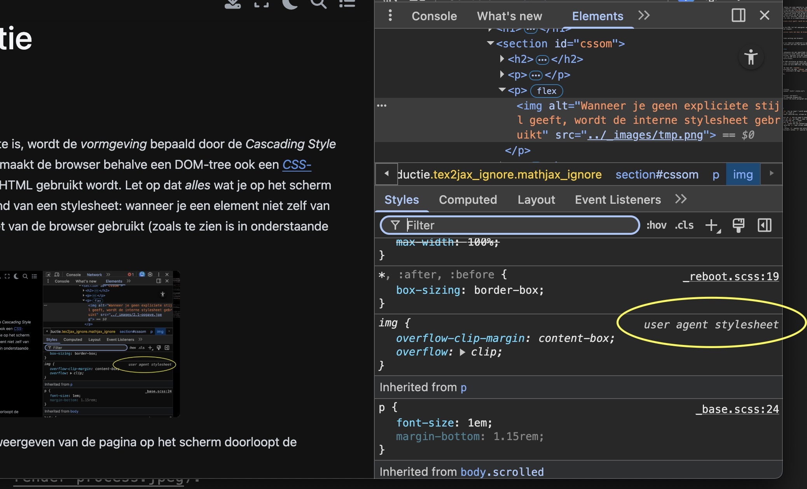

# CSS

## CSSOM 

Waar HTML feitelijk de *data* van onze website is, wordt de *vormgeving* bepaald door de *Cascading Style Sheets* (*CSS*). Om dit voor elkaar te krijgen, maakt de browser behalve een DOM-tree ook een [*CSS-Object-Model*](https://developer.mozilla.org/en-US/docs/Web/Performance/Guides/How_browsers_work#parsing) die voor het renderen van de HTML gebruikt wordt. Let op dat *alles* wat je op het scherm ziet uiteindelijke gestileerd wordt aan de hand van een stylesheet: wanneer je een element niet zelf van een stijl voorziet, wordt de interne stylesheet van de browser gebruikt (zoals te zien is in onderstaande schermafbeelding):




Het proces van laden van de HTML tot het weergeven van de pagina op het scherm doorloopt de onderstaande stappen:

.


```{admonition} Uitgebreide werking van browsers
:class: tip

In webtechnologie 3 gaan we redelijk uitgebreid in op de werking van de browser. Voor de huidige module volstaat het hier wat parate kennis van te hebben.
```

## Selectors en Style-rules

Om onderdelen van onze webpagina van een specifieke stijl te kunnen voorzien, moeten we de browswer natuurlijk laten weten *welk* onderdeel van de DOM we van *welke* stijl willen voorzien. Hiervoor zijn dus twee technieken nodig. Het bepalen van het element uit de DOM doen we met *selectors* en het definiëren van de stijl doen we met *style-rules*.

We kunnen een node in de DOM selecteren op basis van drie eigenschappen: de *naam* van de node, de (waarde van) verschillende *attributen* van die node, of de *positie* van de node binnen de hele DOM-tree. De algemene syntax is als volgt:

- `tagname` selecteert de tags met `tagname`;
- `tagname.classname` selecteert de tags `tagname` waarbij `class="classname"`;
- `tagname[attr='value']` selecteert de tags `tagname` waarbij `attr="value"`.

Zie de onderstaande HTML:

```{code-block} html
---
name: html-demo
linenos: True
---

<html>
    <head>
        <title>DOMdemo</title>
        <link rel="stylesheet" href="./style.css">
    </head>
    <body>
        <div class="container" id="main">
          <h1 lang="NL-nl">Awesome dingen</h1> 
          <p class="container">De beste paragraaf ooit.</p>
        </div>
    </body>
</html>
```

selector | omschrijving
---|---
`div` | Selecteert de `div` die op regel 7 wordt geopend.
`h1` | Selecteert de `h1` op regel 8.
`div.container` | Selecteert dezelfde div, alleen nu op de waarde van het attribuut `class`.
`p.container` | Selecteert de `p` die op regel 9 staat.
`.container` | Selecteert de `div` op regel 7, maar ook de `p` op regel 9; dit omdat er geen specifieke tag vóór de `.` staat.
`h1, p` | Selecteert zowel de `h1` als de `p`.
`div p` | Selecteert de `p` (omdat dat een nakomeling is van de `div`).
`div > p` | Selecteert dezelfde `p`, maar alleen omdat dat een *directe* nakomeling van de `div` is.
`h1[lang]` | Selecteert *elke* `h1` waarbij het attribuut `lang` is ingesteld.
`h1[lang='NL-nl']` | Selecteert *elke* `h1` waarvan het attribuut `lang` de waarde`NL-nl` heeft.
`#main` | Selecteert het element waarvan het attribuut `id` gelijk is aan `main` (die div op regel 7 in dit geval).

```{admonition} Meer uitleg over *selectors*
:class: tip

Je kunt heel veel meer doen met die selectors; bekijk [de documentatie op MDN](https://developer.mozilla.org/en-US/docs/Web/CSS/Guides/Selectors) voor een volledig overzicht.

```


## Style-rules

Wanneer je een node in de DOM-tree hebt gematcht, kunt je door middel van één of meer *style-rules* aangeven hoe die node moet worden weergegeven. De algemene syntax van zo'n *style-rule* is `attribute: value;` (let op: die spatie tussen het attribuut en de waarde is optioneel, de puntkomma na de waarde is dat *niet*). De *style-rules die bij een specifieke node horen, worden gegroepeerd door middel van *accolades*. De volledige vorm van het stileren van een node wordt dus als volgt:

```css
selector {
    attribute1: value1;
    attribute2: value2;
    ...
}
```

Er zijn – letterlijk – honderden verschillende attributen die je kunt instellen, met some tientallen opties per attribuut. Het is niet praktisch (en niet echt nuttig) om ál die verschillende opties uit het hoofd te leren, maar de meest voor de hand liggende en de meest gebruikte moet je als professional (ook als je met name op de backend werkt) toch wel beheersen. Bekijk verder [de documentatie op MDN](https://developer.mozilla.org/en-US/docs/Web/CSS/Reference) om hier een beeld van te krijgen.

## Locatie van de stylesheets

Je kunt de stilering van je webpagina op drie verschillende locaties definiëren:

1. in separate bestanden
2. binnen de `<style></style>`-tags
3. in het `style=""`-attribuut van de tag in kwestie

Het meest gebruikelijke van deze opties is de eerste: separate bestanden. Dit heeft als voordeel dat dezelfde stilering over verschillende html-bestanden gedeeld kan worden, én dat je de stijl radicaal scheidt van de data. 

Een dergelijk bestand bevat eenvoudig de stilering zoals die hierboven is beschreven: er is geen noodzaak van speciale code of *headers* om duidelijk te maken dat het om een *stylesheet* gaat. De enige eis is dat het bestand `.css` als extensie heeft, zodat de browser weet dat dit om een *stylesheet* gaat (en niet, bijvoorbeeld, om een tekst-bestand).

Om een dergelijk bestand aan je HTML-bestand te koppelen, maar je gebruik van de [`link`-tag](https://developer.mozilla.org/en-US/docs/Web/HTML/Reference/Elements/link), waarbij je het `rel`-attribuut zet op `stylesheet`:

```html
<link rel="stylesheet" href="styles/style.css">
```

Je kun meerdere *stylesheets* aan één HTML-document koppelen; hiervoor herhaal je eenvoudig de bovenstaande regel voor elke *stylesheet*.

Om de stilering binnen het HTML-document zelf te definiëren, gebruik je dus de [`style`-tag](https://developer.mozilla.org/en-US/docs/Web/HTML/Reference/Elements/style):

```html
<style>
    body {
        background-color:red;
    }
</style>
```

Net als de `link`-tag, kun je de `style`-tag in principe overal in je HTML-document neerzetten. Het is echter goed gebruik om beide tags in de `header`-tag van je document te plaatsen. Binnen deze tag wordt informatie *over* het HTML-document gezet en de stilering is iets waar dit zeker voor geldt.

De laatste optie, om de stilering direct aan de betreffende tag te koppelen, ziet er als volgt uit:

```html
<p style="background-color:blue;font-size:30px;">
```

Hoewel dit werkt en je het in het wild best wel regelmatig tegenkomt, is dit van de drie opties verreweg de slechtste. Allereerst is de data en vormgeving veel te sterk gekoppeld (weten we nog van [de SOLID-principles](https://www.geeksforgeeks.org/system-design/solid-principle-in-programming-understand-with-real-life-examples/)? – die gelden ook hier), en het onderhouden van de stilering is daardoor een stuk moeilijker: als je een heel groot HTML-document hebt, en je een stilering hebt die je wilt aanpassen, kan het best een zoektocht zijn om te onderzoeken waar die stilering exact vandaan komt.


## Specificiteit
Hoe specifieker selector een node matcht, hoe belangrijker. Dit betekent dat als twee selectors dezelfde node matchen, en deze beide selectors conflicterende stilering definiëren, de stijl die gedefinieerd is in de meest specifieke selector wordt gebruikt. Zie het onderstaande voorbeeld, waarbij we uitgaan van het voorbeeld HTML-document dat we hierboven hebben weergegeven:

```css
div { background-color:green; font-size:20px; }
div.container { background-color:red; }
#main { background-color:blue; }
```

In dat geval wordt de achtergrond van de `<div id="main">` *blauw* weergegeven (de laatste regel in de bovenstaande css 'wint'). Merk op dat de letters nog steeds twintig pixels groot worden gerenderd, omdat die regel niet door de 'winnende' selector wordt overschreven – dit is exact het *cascading*-effect van CSS.

Wanneer de specificiteit geen uitsluitsel geeft, is de algemene volgorde van rendering eigenlijk van onder naar boven:

1. Eerst 'wint' de stilering die gedefinieerd is in het `style=""`-attribuut van de betreffende tag.
2. Vervolgens wordt gekeken naar de stilering in de `<style>`-tag in het HTML-document zelf en naar de externe *stylesheets*.

Mocht het zo zijn dat er dan nog meerdere selectors zijn die dezelfde node selecteren, dan gaat het op volgorde van *laden*: een eerder geladen selector kan door een later geladen worden overschreven.

```{admonition} specificiteit
:class: tip

Dit specificiteit kan een behoorlijk complexe puzzel worden. Zie [dit document op MDN](https://developer.mozilla.org/en-US/docs/Web/CSS/Guides/Cascade/Specificity) voor een nadere beschrijving. Onthoud dat het van belang is dat je het de browser 'zo eenvoudig mogelijk maakt': heel complexe en ingewikkelde *stylesheets* zorgen ervoor dat de browser behoorlijk wat werk moet verrichten, wat de rendertijd niet ten goede komt.
```

