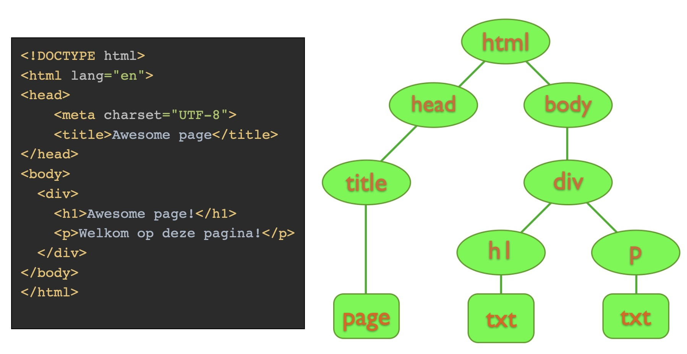

# 2.1 HTML: Introductie

## *Tags* en *Nodes*

Wanneer we werk maken voor het web, dan hebben we onvermijdelijk te maken met HTML: *Hypertext Markup Language* (en met JavaScript, maar dat parkeren we tot webtechnologie 3). HTML is de standaardtaal waarin documenten worden geschreven waarvan het de bedoeling is dat ze in een *webbrowser* worden getoond. 

Een browser ontvangt HTML (meestal, maar niet per se, van een *webserver* – hoe dit proces exact verloopt valt buiten deze module), maakt aan de hand hiervan een *Document Object Model tree* (DOM-tree), bepaalt aan de hand van deze DOM-tree en andere informatie (afbeeldingen, stijling, grootte van het scherm, ...) hoe de onderdelen uit deze tree op het scherm moeten komen en tekent uiteindelijk de informatie op het scherm. Dit hele proces staat bekend onder de term *rendering*.

De basis van HTML is de *informatie* die je uiteindelijk op het scherm wilt hebben. Meestal is dat tekst, maar het kan natuurlijk ook een plaatje of een filmpje of iets dergelijks zijn. Deze tekst kunt je door middel van HTML-tags voorzien van meta-informatie, en die meta-informatie op zijn beurt weer van meta-informatie – en dat recursief zodat je een boomstructuur krijgt. 

HTML-tags beginnen met een *kleiner-dan teken* (`<`), gevolgd door de *naam* van de tag die weer gevolgd wordt door nul of meer *attributen* van die tag. Een tag sluit je af met een *groter-dan teken* (`>`): `<tag attribuut1="value" attribuut2="value1 value2">`. Na deze tag zet je dan datgene wat je binnen die tag wilt hebben, waarna je de tag afsluit door dezelfde naam vooraf te doen gaan door een *slash* (`/`): `</tag>`.

Er zijn – letterlijk – tientallen van dergelijke tags / nodes gedefinieerd (en je kunt ze ook zelf maken), allemaal met hun eigen betekenis en (daaraan gekoppelde) gedrag en vormgeving. Het is nuttig om de meest voorkomende uit het hoofd te kennen, maar een volledig overzicht [is, vanzelfsprekend, te vinden op MDN](https://developer.mozilla.org/en-US/docs/Web/HTML/Reference/Elements).

```{admonition} Documentatie
:class: tip

Om documentatie over webtechnieken te vinden wordt in de regel gebruik gemaakt van [het Mozilla Developer Network (MDN)](https://developer.mozilla.org/en-US/). Hierin staat alles wat met het web te maken heeft zeer uitgebreid beschreven. Behalve het MDN is er ook nog [het World Wide Web Consortium (W3C)](https://www.w3.org/) (onder auspicieën van niemand minder dan [Tim Berners-Lee (TBL)](https://www.w3.org/People/Berners-Lee/)) dat de standaarden webstandaarden definieert en publiceert.

```

Zoals gemeld maakt de browser op basis van de gegeven HTML een DOM-tree. Deze boom bestaat uit *nodes* die uiteindelijk door dezelfde browser *gerenderd* worden. Er is dus een verschil tussen *tags* en *nodes*: de *tag* is het stuk HTML op basis waarvan de browser een instantie van de corresponderende *node* maakt. 

De HTML is gewoon platte tekst die je kunt intypen of genereren, de DOM is een tree structuur die op basis hiervan gemaakt is. Elke *node* in deze DOM is een instantie van een klasse die [`de Node-interface`](https://dom.spec.whatwg.org/#interface-node) implementeert. Bekijk [eventueel de documentatie op MDN](https://developer.mozilla.org/en-US/docs/Web/API/Node#specifications).

De algemene structuur van een HTML-document is dan als volgt:

```html
<html>
  <head>
    <title></title>
  </head>
  <body>
  </body>
</html>
```



Verder is het van belang je te realiseren dat niet elke tag zomaar direct binnen de `body`-tag gezet kan worden. Alleen de zogenaamde [*block-level elements*](https://devdoc.net/web/developer.mozilla.org/en-US/docs/HTML/Block-level_elements.html) kunnen als direct *child* van de body-tag optreden. De belangrijkste *block-level elements* zetten we hieronder:

```text
div
fieldset
footer
form
nav
ol
p
section
table
ul
```

## De vergevingsgezinde browser

De achterliggende structuur voor het renderen van een webpagina is dus een boom. Deze boom wordt gegenereerd op basis van de tags in de gegeven HTML. Het is dus van belang dat die gegeven HTML eenvoudig in een valide boomstructuur omgezet kan worden, wat inhoudt dat alle tags correct gebalanceerd zijn:

```text
<div><span>
    incorrect gebalaceerde tags (de span wordt afgesloten *na* de div)
</div></span>
```

```text
<div><span>
    correct gebalaceerde tags (de span wordt afgesloten *voor* de div)
</span></div>
```

Het probleem waar we als webontwikkelaars tegenaan lopen is dat browsers behoorlijk *vergevingsgezind* zijn. Als de browser in de HTML een verkeerde tag tegenkomt, probeert -ie daar binnen de huidige context wel iets van te maken. Zo is het waarschijnlijk dat de bovengenoemde weergegeven verkeerd gebalanceerde HTML toch wel op een goeie wijze wordt gerenderd en dus goed wordt weergegeven: vanuit de historie en ontstaansgeschiedenis van het web en browsers, gaan browsers erg ver in het laten zien van de uiteindelijke informatie.

Op zich is dit prettig, omdat dit de ontwikkelaars ontslaat van de verplichting erg netjes te werken. Maar aan de andere kant is dit erg onhandig, omdat het de ontwikkelaars ontslaat van de verplichting om erg netjes te werken.

Als je rommelige HTML aan de browser oplevert, heeft die drie consequenties (hieronder weergegeven in afnemende mate van zorgelijkheid):

1. Het *renderen* van de html neemt (aanzienlijk) meer tijd in beslag, omdat de browser meer werk moet uitvoeren.
2. Het is *onvoorspelbaar* hoe de webpagina er in verschillende browsers uit komt te zien, omdat verschillende browsers verschillende manieren hebben om met slecht gebalanceerde HTML om te gaan.
3. Het komt *onprofessioneel* over, dus als je onzorgvuldig bent met je HTML zul je door de industrie en door je collega's minder serieus genomen worden.

Gelukkig zijn de meeste hedendaagse ontwikkelomgevingen zó ingericht dat ze de ontwikkelaar helpen met het maken (of genereren) van valide HTML. En in het ergste geval kun je natuurlijk [een HTML-validator]() gebruiken om je werk te checken


```{admonition} Andere problemen
:class: warning

Die vergevingsgezindheid van de browser komen we op nog wel meer plekken in de ontwikkeling voor het web tegen. Soms kan dat echt leiden tot onverwachte en op het eerste gezicht onverklaarbare resultaten. Het is daarom van belang dat je als webontwikkelaar altijd in de gaten houdt wat je aan het doen bent en hoe je werk binnen de verschillende lagen tot uiting komt.
```

Binnen webtechnologie is er nog veel meer te vertellen over browsers en is er behalve HTML nog een aantal technieken die van belang zijn. Voor de huidige module is het evenwel voldoende om een zekere *working knowledge* van HTML te hebben. In webtechnologie3 gaan we veel dieper in op de technieken van de front-end.