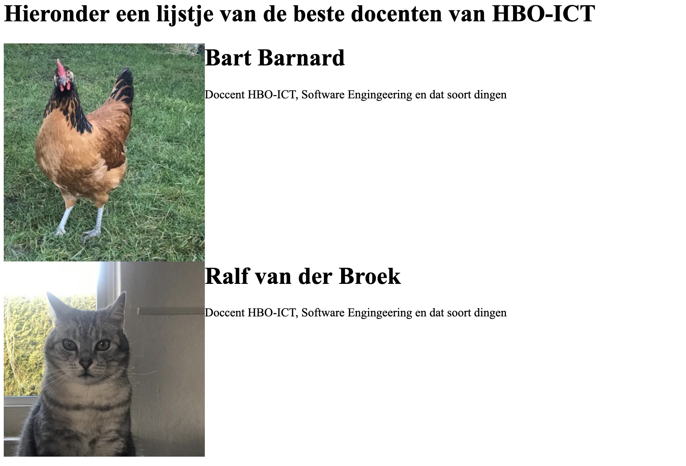
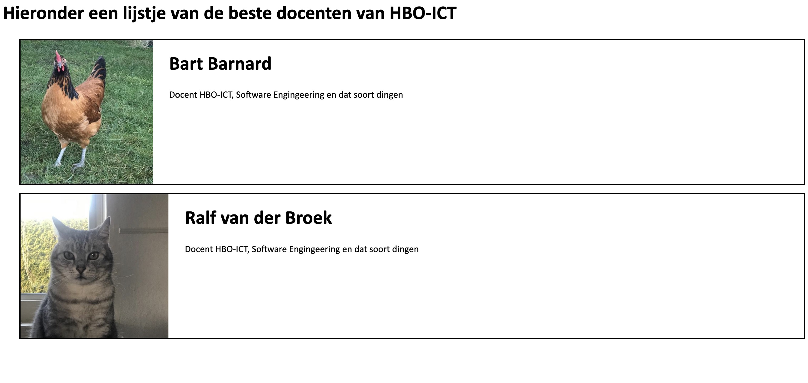
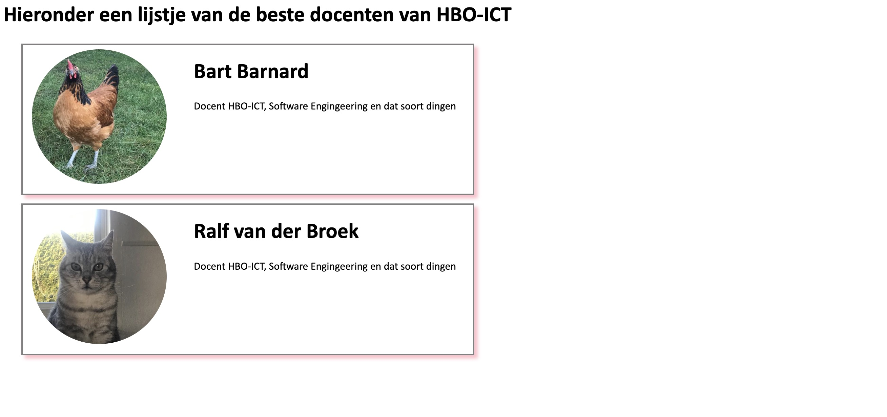

# Oefeningen

Hoewel we ons bij de eindopdracht meer met de backend dan met de frontend bezighouden, is het natuurlijk wel van belang dat je weet *wat* je met die backend op moet leveren. Gebruik de onderstaande oefenignen om een beeld te krijgen van hoe die frontend-tecnieken werken, en hoe deze met de backend samenwerken.

## Voorbereiding

Download het script [`docentenpagina.php`](../_static/docentenpagina.php) en zet het ergens neer zodat je er makkelijk bij kunt. Start in de betreffende directory een ontwikkelserver (`php -S localhost:8000`) en navigeer met een browser naar het script.

Bestudeer het script. Zoals het nu is, doet het nog niks. Er wordt alleen een variabele aangemaakt met de kernwaarden van een aantal docenten. Het is de bedoeling dat je met behulp van de volgende oefeningen het script wat interactiever maakt.

```{admonition} Hernoemen
:class: tip

Hernoem het bestand `docentenpagina.php` naar `index.php`: op deze manier hoef je alleen maar naar `localhost:8000` te gaan om het bestand uit te voeren en het resultaat te zien: als er geen specifiek bestand gevraagd wordt, wordt door de ontwikkelserver het bestand `index.php` (of `index.html`) teruggegeven.
```

## 1. De favoriete docenten

Zorg ervoor dat je, wanneer je naar het bestand navigeert, de gegevens van je favoriete Hanze-docenten weergeeft. Omdat dit een lijstje betreft, is het logisch om deze gegevens in een `ul`-tag te zetten. De gegevens van de docenten zitten dan in geneste `li`'s. 

Pas het script aan, zodat je elke docent van een plaatje kunt voorzien (hiervoor moet je dus de gegeven array uitbreiden en zelf plaatjes vinden). Zorg ervoor dat dit plaatje fatsoenlijke afmetingen heeft en dat de gegevens van de docent rechts van het plaatje staan. Over het algemeen is het een goed idee om die verschillende onderdelen (het plaatje, de gegevens) in separate tags te zetten (bijvoorbeeld `div`s).

Zie de afbeelding hieronder voor een mogelijk resultaat tot dusver.




## 2. Betere stilering

Geeft de `div`s waarin de gegevens van de docenten staan een `class`-attribuut en gebruik vervolgens CSS om de volgende eisen te realiseren:

- maak het font schreefloos (bijvoorbeeld Calibri of Verdana). Zorg er daarbij voor dat wanneer de bezoeker het specifieke font dat je opgeeft niet heeft er wordt teruggevallen op het standaard schreefloze font van het OS.

- zorg ervoor dat de `div`s met de gegevens van de docenten wat verder van elkaar af komen te staan; geef ze wat ruimte links en boven.

- zorg er daarbij wel voor dat de plaatjes binnen de `border` van de betreffende `div` komen te liggen.

- maak wat afstand tussen het plaatje en de tekst.

- voorzie deze `div`s van een `border`, zodat duidelijk is welke gegevens waarbij horen.

Ziet het onderstaande plaatje voor een voorbeeld:




## 3. Wat *fancier* vormgeving

Het geheel kan nog wel wat *fancier* worden vormgegeven. Het is natuurlijk helemaal hip om avatars rond te maken, dus dat gaan we hier nu ook doen: gebruik het css-attribuut [`border-radius`](https://developer.mozilla.org/en-US/docs/Web/CSS/Reference/Properties/border-radius) om dat voor elkaar te krijgen. Zorg er daarbij wel voor dat de afbeeldingen vierkant worden (dus even breed als hoog zijn). 

Verder vinden we de kaartjes van de docenten wel erg breed en *in your face*: maak deze kaartje wat smaller en geef de `border` een wat fijner kleurtje en een schaduw.




## 4. Verticaal centreren

Een lastig ding in HTML/CSS is (nog steeds, hoewel het langzaamaan beter te doen is) het *verticaal centreren* van blocklevel-elementen (wat eigenlijk absurd is wanneer je bedenkt dat [Donald Knuth](https://en.wikipedia.org/wiki/Donald_Knuth) al in de jaren tachtig [`\vfill`](https://www.codespeedy.com/vertically-center-a-text-on-a-page-in-latex/) bedacht had, maar soit). Bestudeer [deze site](http://phrogz.net/CSS/vertical-align/index.html) om een goede uitleg te krijgen van wat het probleem is en hoe het (min of meer) te omzeilen. 

Gelukkig is er tegenwoordig de optie om de display van een div op `flex` te zetten; dat maakt dit allemaal wat makkelijker. Bekijk [deze site](https://css-tricks.com/snippets/css/a-guide-to-flexbox/) om te zien hoe dat werkt. Zorg ervoor dat de tekst van je favoriete docenten nu vertikaal in de `div` komt te staan. In module webtechnologie 3 gaan we nog wat verder in op de flexbox.


## 5. Klikbaar

Maak nu van de hele `li` (de kaart van de docent) een grote hyperlink. Wanneer je op deze kaart klikt, moet je op een pagina komen waarop je de gegevens van de betreffende docent kunt onderhouden. Zorg er bijvoorbeeld voor dat je de naam, de vierlettercode, of de vakken die de docent geeft kunt aanpassen.

Je zult hiervoor de gegevens in de gegeven array moeten overschrijven. Je kunt misschien ook wel een pagina maken waarop je een *nieuwe* docent aan de gegeven array toevoegt.

Zorg ervoor dat de gegevens zoals je die hebt aangepast op het scherm terugkomen. __let op:__ omdat de array alleen maar *in memory* bestaat, worden de wijzigingen die je aanbrengt niet echt opgeslagen - als je de pagina opnieuw laadt, zul je de gegevens uit de oorspronkelijke array weer terugzien.

Mocht je je geroepen voelen, dan is een extra uitdaging om de gegevens van de array *wel* daadwerkelijk op te slaan. Om dit voor elkaar te krijgen kun je gebruik maken van `require_once` en [`file_put_contents`](https://www.php.net/manual/en/function.file-put-contents.php).
