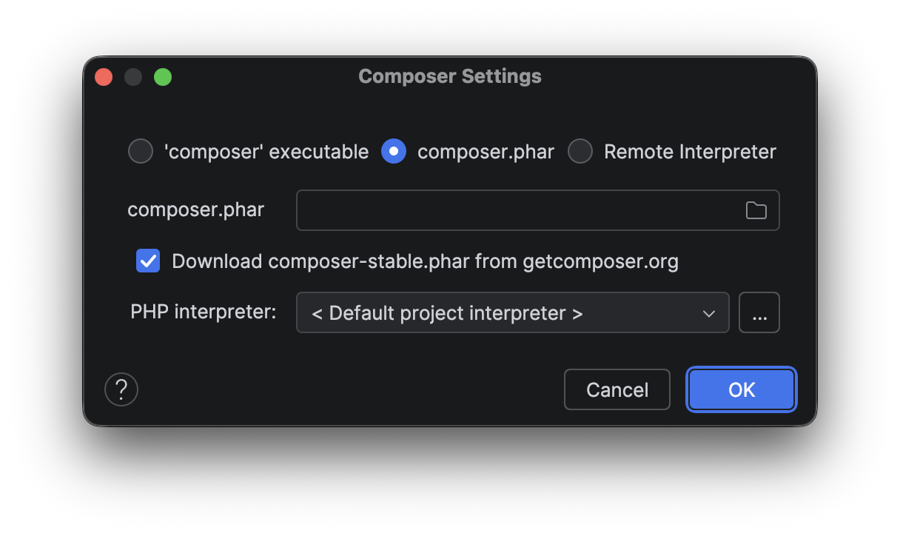

# Composer

Grotere (web)applicaties maken vaak gebruik van een veelvoud aan externe 
library's opdat ze niet steeds het wiel opnieuw hoeven uit te vinden. Een 
voorbeeld hiervan is dat veel webapplicaties in PHP voortbouwen op
[Symfony](https://symfony.com) of
[Laravel](https://laravel.com).
Maar ook die bibliotheken zijn weer afhankelijk van andere library, en 
zo verder, waarbij het vaak ook nog uitmaakt welke versie van een library 
gebruikt wordt. Het managen van deze afhankelijkheden wordt
*dependency management* genoemd. Het is meestal ondoenlijk om dit met de 
hand goed te beheren; automatische oplossingen hiervoor zijn dan ook 
beschikbaar voor veel programmeertalen. Java heeft hiervoor Gradle en Maven, 
Python heeft PIP, JavaScript heeft npm en in PHP wordt hiervoor
[Composer](https://getcomposer.org)
gebruikt.

## Installeren

Composer kan handmatig worden geïnstalleerd, of in sommige gevallen automatisch 
via je IDE. Dit kan in ieder geval als je PhpStorm gebruikt.

De handmatige installatie gaat via een aantal PHP-commando's die in een 
terminal moeten worden uitgevoerd. Deze commando's zijn te vinden op de
[installatiepagina van Composer](https://getcomposer.org/download/). Omdat 
één van deze commando's een checksum bevat die bij elke versie wijzigt, 
kunnen de commando's hier niet gereproduceerd worden. Voer deze commando's 
uit vanuit de hoofddirectory van je project. Na het uitvoeren zal je een 
bestand `composer.phar` aantreffen in deze directory. Het is niet nodig om 
dit bestand globaal te installeren; het is genoeg om dit bestand hier te 
laten staan. Het is wel aan te bevelen het bestand op te nemen in je
`.gitignore`.

Om Composer automatisch te installeren via PhpStorm is het nodig om eerst 
een bestand `composer.json` aan te maken in de hoofddirectory van je project.
Dit bestand wordt nog besproken; het is voor nu voldoende om hier de tekens `
{}` in te zetten. Als je dit bestand maakt, zal je in een balk bovenaan het 
bestand onder meer een optie "Install" krijgen. Als je hierop klikt zal je 
onderstaand venster zien.



Alles staat hier al goed, mits je PHP goed geconfigureerd hebt in PhpStorm, 
en je kan dus gewoon op "OK" drukken om `composer.phar` te laten downloaden 
naar de hoofddirectory van je project.

In beide gevallen krijg je een bestand `composer.phar`. Veel documentatie 
gaat ervan uit dat je Composer globaal hebt geïnstalleerd en dus het 
commando `composer` kan gebruiken. Als je het echter op één van de hier 
beschreven manieren hebt geïnstalleerd, is dat niet zo. Je moet dan in 
plaats van `composer` het commando `php composer.phar` gebruiken. Alle 
opties die je achter het commando `composer` zou zetten kan je ook achter 
dit commando zetten. Je kan controleren of Composer goed geïnstalleerd is 
door het commando `php composer.phar` zonder verdere opties te gebruiken. 
Als het goed geïnstalleerd is, zal je een samenvatting van de opties van 
Composer te zien krijgen.

## Dependency management

De primaire functie van Composer is, zoals gezegd, dependency management. 
Om aan te geven welke afhankelijkheden nodig zijn in een applicatie worden 
deze in een bestand `composer.json` gezet. Nadat Composer uitgezocht heeft 
welke versies hiervan geïnstalleerd moeten worden en welke indirect 
afhankelijkheden daarvoor nodig zijn, wordt al die informatie in een bestand 
`composer.lock` gezet. Beide bestanden moeten opgenomen worden in 
versiebeheer. In `composer.json` zal dus bijvoorbeeld staan dat Symfony 8 of 
hoger nodig is, en in `composer.lock` staat precies welke versie van Symfony 
geïnstalleerd wordt en welke andere library's hiervoor nodig zijn.

Om een afhankelijkheid toe te voegen aan `composer.json` kan het commando 
`composer require` worden gebruikt. Om bijvoorbeeld Symfony 8 of hoger te 
installeren, kan onderstaand commando worden gebruikt.

```shell
php composer.phar require symfony/symfony ^8.0
```

Hierbij is `symfony/symfony` de naam van het Symfony-package. Je kan deze 
vinden op
[Packagist](https://packagist.org),
dit is de repository waar de packages staan die Composer installeert. Om aan 
te geven dat je versie 8 of hoger wilt kan je `^8.0` gebruiken; dit betekent 
dat je een versie wilt hebben die minimaal 8.0 is maar niet versie 9. Dit is 
meestal wenselijk omdat *major* versies vaak *backwards incompatible* 
veranderingen hebben en je dus alleen naar versie 9 wil als je hier bewust 
voor kiest. Als je echt versie 8.0 of hoger wilt hebben, dus ook versie 9, 
kan je het versienummer `>=8.0` gebruiken. Omdat hier een groter-danteken in 
voorkomt, moet je, als je dit in de terminal gebruikt, hier aanhalingstekens 
om zetten, dus `composer require symfony/symfony '>=8.0'`.

Merk overigens op dat dit niet de gangbare manier is om Symfony te 
installeren; het is hier slechts als voorbeeld bedoeld.

Na het uitvoeren van dit commando zul je zien dat `composer.json` er, als 
deze eerst leeg was, er als volgt uitziet.

```json
{
    "require": {
        "symfony/symfony": "^8.0"
    }
}
```

Je kan dit bestand ook rechtstreeks aanpassen, dus zonder `composer require`.
Het is in
[JSON](https://nl.wikipedia.org/wiki/JSON)-formaat,
dus je moet erop letten dat als je nog een library toevoegt, je een komma 
zet na het versienummer van Symfony.

Om de wijzigingen in `composer.json` door te voeren, zijn twee commando's 
beschikbaar. Het eerste commando is `composer update`. Dit bekijkt welke 
afhankelijkheden nodig zijn om de library's in `composer.json` te gebruiken 
en kijkt wat de nieuwste versies zijn die aan het opgegeven versienummer 
voldoen. Deze informatie wordt opgeslagen in `composer.lock` en de gevonden 
packages worden geïnstalleerd.

Het andere commando is `composer install`. Dit commando zal de 
afhankelijkheden die eerder zijn vastgelegd in `composer.lock` gebruiken; 
wijzigingen in `composer.json` worden niet meegenomen, en als er nieuwe 
versies van de library's zijn worden die ook niet geïnstalleerd. Dit 
commando is dus geschikt om ervoor te zorgen dat je over exact dezelfde 
versies beschikt als iemand anders, zoals wenselijk is op productiesysytemen.

In beide gevallen worden de gedownloade packages geïnstalleerd in de 
directory `vendor`. Het is meestal verstandig om deze directory op te nemen 
in `.gitignore`, aangezien je hem altijd opnieuw met `compoer installl` kan 
genereren. Dit betekent echter wel dat je afhankelijk bent van Packagist, en 
erop moet vertrouwen dat daar geen malware op staat. Voor sommige kritieke 
projecten is dat niet acceptabel; dan zal het noodzakelijk zijn ook de code 
van je afhankelijkheden op te nemen in versiebeheer.

## Autoloader

Naast de PHP-code van de gedownloade library's genereert Composer ook een 
bestand `vendor/autoload.php` en een aantal hulpbestanden hiervoor. Dit 
bestand bevat een autoloader die ervoor zorgt dat alle libraries die 
geïnstalleerd zijn via Composer beschikbaar zijn via een autoloader. Om deze 
autoloader te gebruiken, zet je het statement `require_once
'vendor/autoload.php'` aan het begin van de PHP-bestanden die door de 
webserver kunnen worden aangeroepen. Daarna kan je gewoon gebruik maken van 
de klassen die in de geïnstalleerde packages staan.

Je kan ook je eigen klassen laten toevoegen aan de autoloader van Composer. 
Hier zijn enkele mogelijkheden voor, maar het is in principe altijd 
voldoende om de PSR-4-variant te gebruiken.
[PSR-4](https://www.php-fig.org/psr/psr-4/) is één van de
[PHP Standard Recommendations](https://www.php-fig.org) van de PHP Framework 
Interop Group; PSR-4 beschrijft een manier om te bepalen welke klasse in 
welk bestand opgeslagen moet worden.

Kort gezegd komt het erop neer dat bij een namespace een directory gegeven 
wordt, en dat alle klassen binnen die namespace corresponderen met bestanden 
in die directory. Als bijvoorbeeld de namespace `Library` in de directory 
`lib` staat, dan zou de klasse `Library\Foo\Bar` te vinden moeten zijn in 
het bestand `lib/Foo/Bar.php`. Het is mogelijk om deze koppeling te 
definiëren in `composer.json` in de sleutel `psr-4` binnen de sleutel 
`autoload`, hetgeen er ongeveer als volgt uitziet.

```json
{
  "autoload": {
    "psr-4": {
      "Library\\": "lib/"
    }
  },
  "require": {
  }
}
```

Merk op dat er een backslash moet staan aan het einde van de namespace en 
dat die verdubbeld moet worden omdat deze anders het dubbele aanhalingsteken 
escapet.

Een veelgebruikte variant is om alle klassen te autoloaden vanuit een 
directory `src`. Hiervoor zet je de regel `"": "src/"` binnen de sleutel
`psr-4`.

Na het aanpassen van `composer.json` kan je `composer install` of `composer 
update` gebruiken om de autoloader bij te werken.
