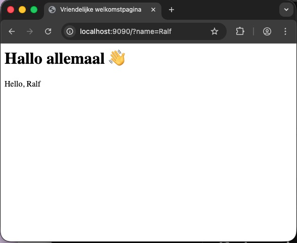

# Templating

Tot nu toe hebben we in de methode `handle` van onze diverse kernels eenvoudig een stuk tekst teruggegeven:

```php
<?php
  //andere code weggelaten
  public function handle(Request $request): string
  {
    $name = $request->getQueryParams()['name'];
    return "Hello, $name";
  }
```

Hoewel dit werkt, spreekt het redelijk voor zich dat dit niet echt schaalbaar of onderhoudbaar is. In de regel bestaan *responses* uit vele kilobytes aan data, en de zou niet handig zijn wanneer we al deze data eenvoudig als string in een `handle`-methode zouden definiëren:

```php
<?php
  //andere code weggelaten
  public function handle(Request $request): string
  {
    $name = $request->getQueryParams()['name'];
    return "
<!DOCTYPE html>
<html lang="nl" data-content_root="../" >

  <head>
    <meta charset="utf-8" />
    <meta name="viewport" content="width=device-width, initial-scale=1.0" /><meta name="viewport" content="width=device-width, initial-scale=1" />
    <title>Request &#8212; Webtechnologie II</title>
  <script data-cfasync="false">
    document.documentElement.dataset.mode = localStorage.getItem("mode") || "";
    document.documentElement.dataset.theme = localStorage.getItem("theme") || "";
  </script>
    ...
    </body></html";
```

Om deze reden willen we de *html* scheiden van de *logica* van onze applicatie. De gedachte is dan dat onze `handle`-methode het juiste html-bestand opzoekt en deze retourneert.

Behalve deze voor de hand liggende reden, zijn er nog twee eveneens belangrijke, maar minder evidente redenen voor deze scheiding. Allereerst is het schrijven van goede html een heel andere capaciteit dan het schrijven van progammacode – activiteiten die derhalve dikwijls door diverse personen worden gedaan. Een dergelijke scheiding maakt het samenwerking door deze personen een stuk eenvoudiger.

En zelfs – ten tweede – wanneer dezelfde persoon zowel de html als de programmacode schrijft, dan nog is het voor deze persoon lekker wanneer hij of zij zich helemaal kan richten op het één of het ander. Wanneer je de hele tijd moet schakelen tussen code of html zal dat de concentratie op beiden niet ten goede komen.

## Model-View-Controller

De scheiding tussen logica, html en data kent binnen software engineerin een relatief oude en goede traditie – ouder dan internet of html. Het staat bekend onder de term *Model-View-Controller*, wat eind jaren zeventig is bedacht door [Trygve Reenskaug](https://en.wikipedia.org/wiki/Trygve_Reenskaug). Zoals de naam al doet vermoeden, kent deze architectuur drie onderdelen:

- Het *model* is de interne representatie van de informatie die door het systeem beschikbaar gemaakt wordt.
- De *view* is de presentatie van deze informatie, dat wat de bezoeker of gebruiker van de applicatie ziet en waar hij of zij mee interacteert.
- De *controller* is de *applicatielogica* die de verbinding maakt tussen de *view* en het *model*.

Zie het plaatje hieronder (van [wikipedia](https://nl.wikipedia.org/wiki/Model-view-controller)). Hierin zie je hoe de gebruiker van een systeem interacteert met de controller. Deze *controller* verandert de interne representatie van het model, waardoor de *view* geüpdate wordt, wat de gebruiker vervolgens weer ziet.


Er zijn verschillende antwoorden mogelijk op de vraag hoe de view aan de actuele informatie komt. In het plaatje hierboven komt het over alsof het model zelf verantwoordelijk is voor het updaten van de view, maar meestal gaat dat via de controller. Er zijn overigens in de loop der tijd allerlei subtiele varianten van het standaardmodel bedacht, zoals [*Model View Adapter*](https://en.wikipedia.org/wiki/Model%E2%80%93view%E2%80%93adapter), het [*Model View Presenter*](https://en.wikipedia.org/wiki/Model%E2%80%93view%E2%80%93presenter) of het [*Model View ViewModel](https://en.wikipedia.org/wiki/Model%E2%80%93view%E2%80%93viewmodel) (wat in iOS applicaties gebruikt wordt).

In een webcontext is het model in de regel een *database*, de controller wordt gevormd door de verschillende *controllers* (waar we het al over hebben gehad) en is de *view* de uiteindelijke html die door de client wordt gerenderd. Het is de bedoeling van de controller om de representatie van de data in de view te injecteren en deze vervolgens naar de client te sturen.


## Een html-bestand inlezen

Laten we verder gaan met de `HelloKernel`, waar we [in hoofdstuk 3.1](../3.1-request/request.md) mee zijn begonnen. Dankzij de DSL-opbouw van PHP is het vrij eenvoudig om direct een html-bestand in te lezen. Stel je voor dat we het onderstaande (zeer eenvoudige) html-bestand `welkom.html` in een directory `templates` hebben gezet:

```html
<html>
<head>
    <meta charset="UTF-8">
    <title>Vriendelijke welkomstpagina</title>
</head>
<body>
    <h1>Hallo allemaal 👋</h1>
</body>
</html>
```

De methode `handle` in `HelloKernel` zag er tot nu toe als volgt uit:

```php
<?php
  //andere code weggelaten
  public function handle(Request $request): string
  {
    $name = $request->getQueryParams()['name'];
    return "Hello, $name";
  }
```

We kunnen de html van hierboven eenvoudig in deze methode inladen, door gebruik te maken van de - inmiddels overbekende - functie [`require`](https://www.php.net/require):

```php
<?php
  //andere code weggelaten
  public function handle(Request $request): string
  {
    $name = $request->getQueryParams()['name'];
    require 'templates/welkom.html';
    return "Hello, $name";
  }
```

Als je dit stukje code uitvoert, zul je zien dat een request naar de juiste pagina inderdaad de html laat zien:



Dit resultaat is te verwachten wanneer je bedenkt hoe `require` ook al weer werkt: deze functie laadt een pagina in en voert de code daarin direct uit. Omdat dit html is, en er feitelijk geen php-code in staat, is het resultaat van deze functie-aanroep gewoon de html die in het betreffende bestand staat. En je ziet dat het return-statement in `handle` ook nog steeds effect heeft: de html wordt dus als het ware middenin die functie naar de client gestuurd.

Vanzelfsprekend is dit ongewenst gedrag. Niet alleen willen we niet dat er zomaar middenin een functie data naar een client wordt gestuurd, maar we willen ook controle houden over de data zolang deze zich in de functie bevindt.

## Output buffering

Om te voorkomen dat de output direct (zo snel mogelijk) naar de client wordt gestuurd, kunnen we gebruik maken van een techniek die bekend staat onder de naam *output buffering*. Wat dit feitelijk doet is alle data die normalitair zou worden uitgestuurd (geprint naar de terminal, verstuurd naar een client) *tegenhouden*, net zo lang totdat het commando gegeven wordt om de opgeslagen output uit te printen (te *flushen*).

In php zijn hiervoor de volgende commando's van belang:

- [`ob_start()`](https://www.php.net/ob_start): aanzetten van *output buffering. In de documentatie lezen we "While output buffering is active no output is sent from the script, instead the output is stored in an internal buffer."
- [`ob_flush()`](https://www.php.net/manual/en/function.ob-flush.php): het versturen van de inhoud van de buffer naar de *output handler*.
- [`ob_get_clean()`](https://www.php.net/manual/en/function.ob-get-clean.php): haalt de huidige inhoud van de *output buffer* op en zet het bufferen weer uit.

Met deze kennis kunnen we de `handle`-methode in de `Kernel` als volgt aanpassen:

```php
<?php
  //andere code weggelaten
  public function handle(Request $request): string
  {
    ob_start();
    $name = $request->getQueryParams()['name'];
    require 'templates/welkom.html';
    $html = ob_get_clean();
    return $html . "Hello, $name";
  }
```

Als je dit runt, zul je zien dat het resultaat nog steeds hetzelfde is. Dat is ook logisch, want functioneel hebben we eigenlijk nog niks aan de code veranderd. We weten evenwel hoe we php in html kunnen laten zien, bijvoorbeeld door gebruik te maken van de short-tag `<?= ... ?>`. Omdat de scope van `$name` binnen dezelfde score als de `ob_start()` valt, is deze variabele ook onmiddellijk bekend binnen onze template:

```html
<html>
<head>
    <meta charset="UTF-8">
    <title>Vriendelijke welkomstpagina</title>
</head>
<body>
    <h1>Hallo <?= $name ?> 👋</h1>
</body>
</html>
```


## De functie `Eval`

Net als in de meeste andere programmeertalen kun je ook in php een string als php-code laten uitvoeren: in php gebruiken we hiervoor [de functie `eval`](https://www.php.net/eval). Zie het onderstaande voorbeeld: op regel 2 definiëren we een variabel `$str` die een stukje valide php-code bevat. Deze code wordt op regel 3 uitgevoerd, waardoor de variabele `$demo` geïnitialiseerd wordt en een waarde krijgt. Vervolgens wordt op de laatste regel die variabele afgedrukt.

```{code-block} php
---
name: eval-script
linenos: True
---
<?php
$str = "\$demo=32;";
eval($str);
echo $demo;
```

Je ziet dat we `$demo` niet echt expliciet hebben gedefinieerd: de IDE geeft ook aan dat die variabele niet bestaat - wat logisch is, want die IDE gaat niet al je strings langs om te checken of er toevallig valide php-code in staat, en gaat die zeker niet zonder meer voor je uitvoeren.

```{admonition} Gevaarlijk
:class: warning
Je kunt je voorstellen dat deze functie behoorlijk gevaarlijk is, omdat het zonder meer arbitraire php-code kan uitvoeren. Naar het schijnt heeft Rasmus Lerdorf *himself* ooit gesteld dat "if eval is your answer you are probably asking the wrong question".

Toch maken we voor dit onderdeel gebruik van deze functie. Dat kan op zich ook wel, zolang we maar de controle over de gebruikte templates en de data in eigen beheer houden.
```