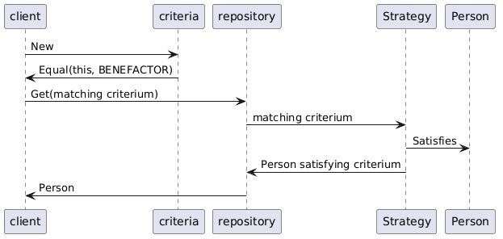
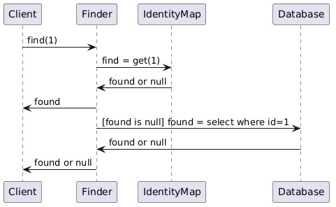
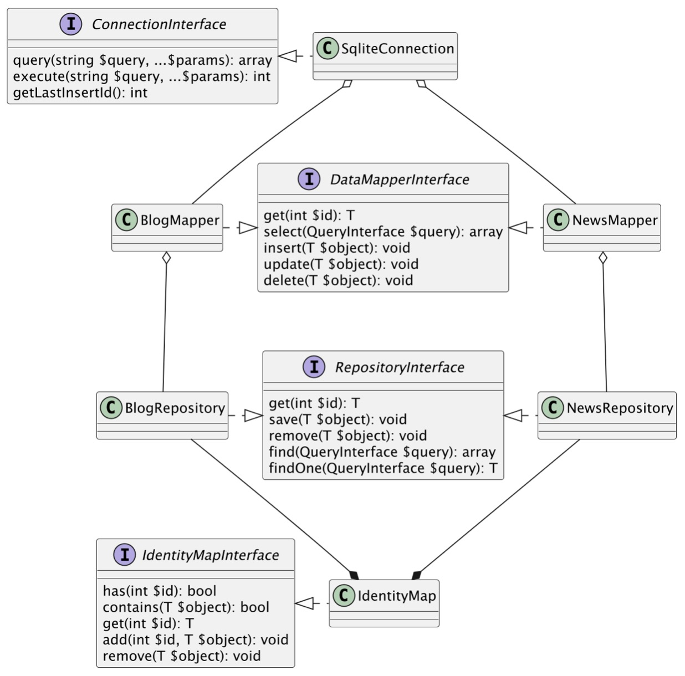

# De identity map

## Introductie

De [data mapper](model-klassen.md#datamapper) is alleen verantwoordelijk voor het opzoeken en onderhouden van enkele objecten. Dikwijls is het echter handig om een hele *verzameling* van objecten in het geheugen van je applicatie te hebben staan. Met name wanneer je te maken krijgt met complexere transactie, veel en snelle *user-access sessions* of het doorzoeken van grote objectengrafen. Wanneer je dit allemaal via de *gemapte* model-klassen wilt doen, zul je zien dat de logica nog te sterk gekoppeld is met de data-laag.

Om dit te voorkomen, introduceren we *nog* een laag van abstractie: een (*in memory*) *repository* van *gemapte* domeinobjecten die je vanuit je applicatielaag kunt bevragen en doorzoeken.

## Repository

Als je naar [de beschrijving van dit patroon door Martin Fowler kijkt](https://martinfowler.com/eaaCatalog/repository.html), lees je het volgende:

> Mediates between the domain and data mapping layers using a collection-like interface for accessing domain objects.

De repository abstraheert dus feitelijk de daadwerkelijke persistentie. Het is voor de logica van je applicatie niet relevant of de data wordt opgeslagen in een database, in xml- of json-bestanden of via ORM. Op deze manier kan je applicatie dus de wijze van persisteren feitelijk negeren (wat het testen en onderhouden weer makkelijker maakt).

De [interface van de repository](interface.md) kent ook feitelijk dezelfde soort operaties als die je bij een database zou verwachten. Het is alleen aan de instantie van de klasse die deze interface implementeert om te bepalen waar -ie de data vandaan haalt: uit het geheugen of uit de database (of iets anders). Zie het onderstaande sequentiediagram:




Het is natuurlijk van belang dat binnen deze *repository* individuele objecten maar één keer voorkomen (ze komen immers ook maar één keer voor in de database). Hiervoor gebruik je een *identity map*.

## Identity Map

De identity map houdt de interne lijst van objecten bij die de applicatie nodig heeft. Specifiek werkt de Identity Map zoals in het onderstaande sequentie-diagram wordt weergegeven (overgenomen van [de site van Martin Fowler]()):



Een klein voorbeeld van de werking hiervan zie je hieronder:

```php
<?php
class IdentityMap implements IdentityMapInterface {
    private array $data = [];

    public function has(int $id): bool
    {
        return isset($this->data[$id]);
    }

    public function add(int $id, $object): void
    {
        $this->data[$id] = $object;
    }

    ///
}
```

## Werking

Uiteindelijk heeft de repository dus *zowel* een Identity Mapper als een Data Mapper nodig. Als de repository vervolgens om een object gevraagd wordt (via `get(int $id)`), kijkt -ie eerst of dat object al *in memory* aanwezig is. Als dat het geval is, wordt dat geretourneerd. 

Als dat niet het geval is, wordt aan de Data Mapper om het specifieke object gevraagd. Deze Data Mapper checkt de database en retourneert het object, zo het in de database bestaat. De repository voegt het gevonden object aan de identitymapper toe en retourneert het object.

Wanneer als deze beide methoden van zoeken niets opleveren, wordt er een exceptie opgeworpen. Een mogelijke tentatieve uitwerking van dit stappenplan zie je hieronder:

```php
<?php
public function get(int $id): object
{
    if ($this->identity_map->has($id)) {
        return $this->identity_map->get($id);
    }

    $object = $this->data_mapper->get($id);
    if (!$object) {
        throw new NotFoundException(strval($id));
    }

    $this->identity_map->add($object->{$this->primary_key}, $object);
    return $object;
}
```

Op een abstract niveau ziet deze hele infrastructuur er dan als volgt uit:




