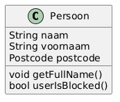
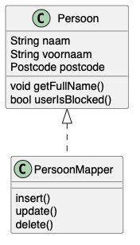

# Van modellen naar de database

## Model-klassen

Zoals we hebben gezien bij [Model-View-Controller](../4.1-templating/intro.md#model-view-controller) willen we graag gebruik maken van php-klassen (objecten) die de *state* van onze applicatie bijhouden en representeren: de zogenaamde *model-klassen*. In dit specifieke voorbeeld gaan we er voor het gemak van uit dat de model-klassen eenvoudig representaties zijn van tabellen in de database (daarmee overbruggen we feitelijk de [*paradigm-mismatch](paradigm-mismatch.md)).

Een model-klasse is een klasse die een vertaling (*mapping*) maakt tussen een tabel in de database en een object in je programmacode. De entiteit in je database wordt gepersisteerd en opgehaald en *in memory* gebruikt in je applicatie.

Behalve de gegevens die in de database zijn opgeslagen, kan een model-klasse ook bepaalde functionaliteit (logica) bevatten die niet in de database gereflecteerd wordt. Het gaat er om dat een model-klasse en *staat* heeft die op enig moment gepersisteerd moet worden.



```php
<?php
class UserModel
{
    private bool $isBlocked = false;

    public function __construct(
        public readonly string $naam,
        public readonly string $email,
    )
    {}

    public function getFullName(): string {
        return "$this->naam <$this->email>";
    }

    public function userIsBlocked(): bool {
        return $this->isBlocked;
    }
}
```

## DataMapper

Om de Model-klassen te koppelen aan de database, wordt gebruik gemaakt van een `DataMapper`: een object dat verantwoordelijk is voor het persisteren van de relevante data uit de `ModelClass`. Op deze manier hoeft de modelklasse niets te weten van de manier waarop deze wordt opgeslagen.



De [interface van de datamapper](interface.md#datamapperinterface) maakt gebruik van [generic `T`](generics.md) om duidelijk te maken welk type (modelklasse) er via deze mapper wordt bijgehouden. Kijk bijvoorbeeld eens naar de definitie van `get` uit de interface, die we hieronder hebben herhaald. In de signatuur zie je dat deze methode een `object` teruggeeft, maar uit de *DocBlock* blijkt dat het hier om het type `T` gaat, dat we bovenin de interface als `@template` hebben gedefinieerd.

```php
<?php
    /**
     * Select a single object by its primary key.
     * @param int $id
     * @return T
     * @throws NotFoundException if the object was not found.
     */
    public function get(int $id): object;
```

Omdat de DataMapper een koppeling is tussen een (Model)Klasse en een tabel in de database, moeten instanties van deze klasse beide kanten van die verhaal kennen. Het is logisch om dat in de constructor van de klasse op te nemen:

```php
<?php
class UserMapper implements DataMapperInterface {
    public function __construct(
        private ConnectionInterface $connection,
        private string $class_name,
        private string $table_name,
        // rowid is de standaard primaire sleutel die door Sqlite wordt gemaakt
        private readonly string $primary_key = 'rowid'
    ){}
    ///
}
```

Meer over de DataMapper is te vinden [op de website van Martin Fowler](https://martinfowler.com/eaaCatalog/dataMapper.html).


