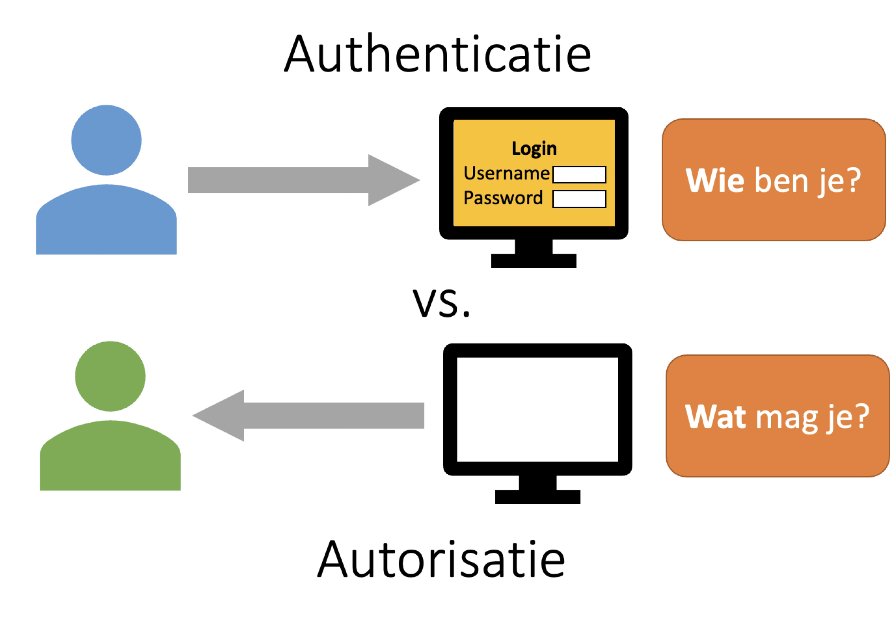
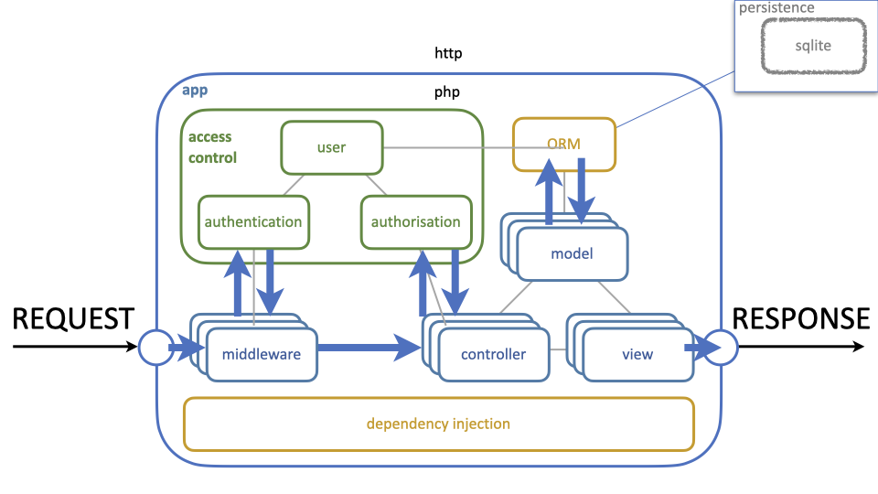

# Authenticatie en autorisatie

In veel webapplicaties is het van belang om te weten wie de gebruiker is. 
Waar je in de echte wereld kan zien wie iemand is, eventueel met behulp van 
bijvoorbeeld een medewerkerspas, is dit in een webapplicatie lastiger. Toch 
bestaat deze wens nog steeds, en vaak ook om dezelfde redenen. Niet elke 
gebruiker mag bijvoorbeeld alle pagina's van een applicatie zien. Een 
artikel mag misschien wel door iederen bekeken worden, maar alleen door de 
auteur gewijzigd. Ook kan het zo zijn dat, bijvoorbeeld vanwege 
wetgeving, bepaalde pagina's alleen door meerderjarige bezoekers bekeken 
mogen worden. 

Dit probleem laat zich opdelen in twee deelproblemen. Het eerste deel is de 
vraag *wie* de gebruiker is. Dit is een identificatieprobleem. In de echte 
wereld worden hiervoor bijvoorbeeld paspoorten, rijbewijzen of 
medewerkerpassen gebruikt. Online worden hier traditioneel wachtwoorden voor 
gebruikt. Dit wordt
[*authenticatie*](https://nl.wikipedia.org/wiki/Authenticatie) genoemd.

Het tweede deel is de vraag *wat* een gebruiker mag, welke rechten deze 
heeft. Dit kan plaats- en tijdafhankelijk zijn, afhankelijk van de volledige 
identiteit of slechts een deelaspect zoals leeftijd. Zo mag iemand met een 
medewerkerspas van de Jumbo wellicht niet bij de dienstingang van de Albert 
Heijn naar binnen, ondanks dat ze diens identiteit wel vast kunnen stellen. 
Dit heet
[*autorisatie*](https://nl.wikipedia.org/wiki/Autorisatie).



We zullen zien dat authenticatie een relatief generiek probleem is en daarom 
voornamelijk op het niveau van een framework of zelfs daarboven kan worden 
opgelost. Autorisatie is veel applicatie-specifieker; meer dan enkele 
ondersteunende functionaliteiten zal een framework hier niet kunnen bieden.

Authenticatie en autorisatie vereisen allebei de aanwezigheid van een 
gebruikersobject, dat meestal gepersisteerd wordt via een ORM. Authenticatie 
wordt normaal gesproken voor het routeren van het request uitgevoerd, 
terwijl autorisatie vaak in een controller wordt uitgevoerd. Dit leidt tot 
onderstaand architectuurschema.



## Authenticatie

Het fundamentele probleem van authenticatie is het identificeren van een 
gebruiker. Aangezien de enige invoer die de webserver krijgt een request is, 
zal deze authenticatie plaatsvinden door middel van informatie uit dat 
request. Hiervoor kan dus een interface `AuthenticationInterface` worden 
gedefinieerd die dit tot uitdrukking brengt in de aanwezigheid van een 
enkele functie `authenticatie` die een request als parameter krijgt en een 
gebruikersobject teruggeeft.

```php
interface AuthenticationInterface
{
   function authenticate(RequestInterface $request): UserInterface;
}
```

Hierbij zijn er grofweg twee mogelijkheden. Ofwel de gebruiker identificeert 
zich op dit moment, dat wil zeggen, er was voor dit request nog geen 
ingelogde gebruiker, ofwel de gebruiker heeft zich al eerder geïdentificeerd.
Omdat HTTP stateless is, zullen ook in dat laatste geval alle relevante 
gegevens aanwezig moeten zijn in het request. In het eerste geval zullen de 
authenticatiegegevens vermoedelijk in de request body, beschikbaar via
`RequestInterface::getParsedBody`, staan. In het tweede geval moeten we een 
mechanisme gebruiken dat de statelessness van HTTP omzeilt. Hiervoor worden, 
zullen we nog zien, de zogeheten *cookies* en *sessions* worden gebruikt.

Nadat de gebruiker geauthenticeerd is, is het handig om deze in het request 
te zetten. Hiervoor kan `RequestInterface::withAttribute` gebruikt worden. 
Op deze manier is het voldoende om op een enkele plek, bijvoorbeeld in de 
kernel, `authenticate` aan te roepen. De gevonden gebruiker kan dan in het 
request gezet worden zodat de rest van de applicatie hier gebruik van kan 
maken.

## Gebruikers

Om gebruikers in het systeem te kunnen representeren is een interface 
hiervoor nodig. Hiervoor zullen we de interface `UserInterface` gebruiken.

```php
namespace Framework\AccessControl;

interface UserInterface
{
    function getUsername(): string;
    function getPasswordHash(): string;
    function isAnonymous(): bool;
}
```

Een gebruiker heeft altijd een gebruikersnaam; omdat we in dit framework 
altijd met een wachtwoord zullen inloggen is het ook nodig om hier een hash 
van te hebben. Dit wordt nog in detail besproken, maar kort gezegd is het 
nooit toegestaan om *plaintext*-wachtwoorden in de database op te slaan. In 
plaats daarvan slaan we een hash op die we bij het inloggen kunnen 
vergelijken met het dan ingevulde wachtwoord.

Ten slotte kan een gebruiker ingelogd of anoniem zijn; als er geen 
gebruikersinformatie in het request aanwezig is zal de authorisatieservice 
een gebruikersobject teruggeven waarbij `isAnonymous` de waarde `true` 
teruggeeft. Hier kan een aparte klasse voor gemaakt worden die de interface 
implementeert en hardcoded waardes teruggeeft voor alle methodes.

Bij het inloggen zal de gebruiker een gebruikersnaam opgeven. Om het 
wachtwoord te kunnen vergelijken is het eerst noodzakelijk om het 
gebruikersobject behorende bij de gebruikersnaam te vinden. In beginsel zou 
hiervoor een implementatie van `RepositoryInterface` gebruikt kunnen worden; 
gebruikers staan immers meestal in de database. Dat zou echter leiden tot 
een harde koppeling tussen het authenticatiesysteem en de database. Daarom 
wordt een aparte interface `UserProviderInterface` gebruikt, die een enkele 
methode `get` heeft, die een gebruiker ophaalt aan de hand van diens 
gebruikersnaam. Als deze gebruiker niet bestaat, zal de methode een anonieme 
gebruiker teruggeven.

```php
namespace Framework\AccessControl;

interface UserProviderInterface
{
    function get(string $username): UserInterface;
}
```

Hiermee kan een gebruiker worden opgehaald, zonder dat het 
authenticatiesysteem hoeft te weten hoe dit gebeurt. Het is echter zeker 
denkbaar dat er een `UserRepository` is die zowel `RepositoryInterface` als 
`UserProviderInterface` implementeert.
