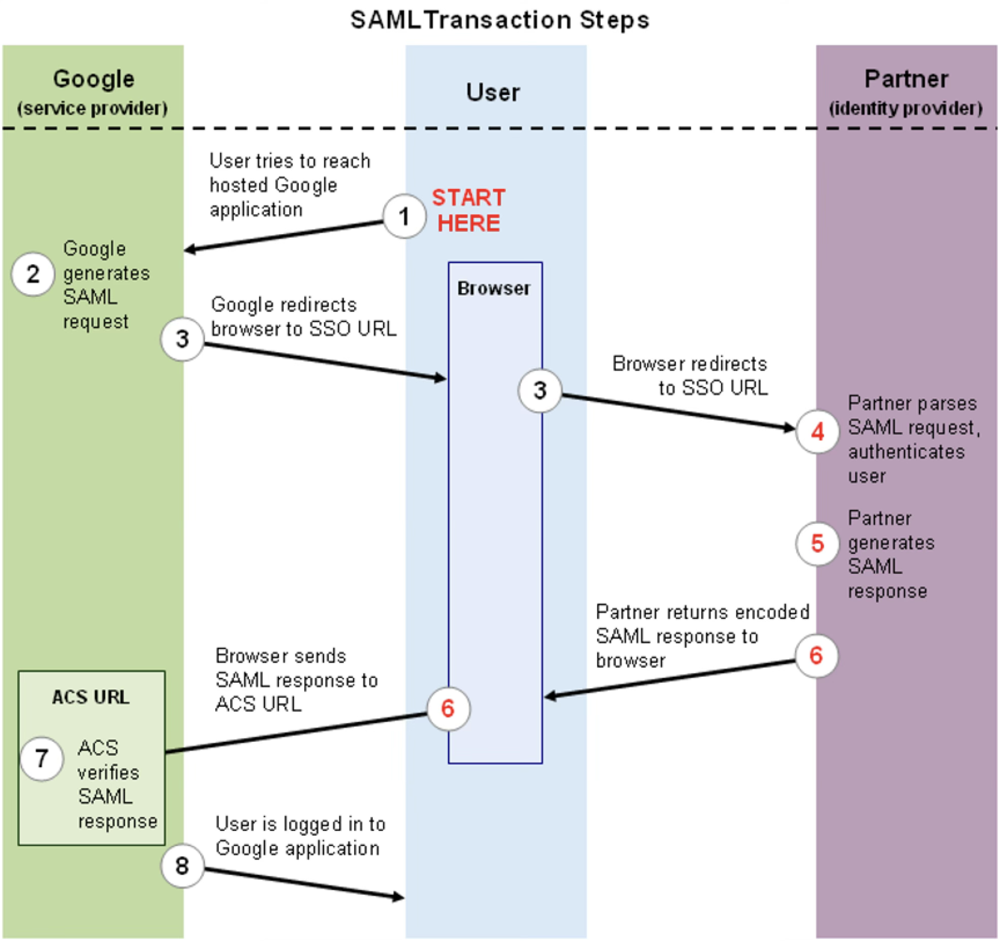

# Inloggen

Het proces van inloggen is het proces waarmee de gebruiker zich 
authenticeerd bij de webapplicatie. Klassiek worden hiervoor wachtwoorden 
gebruikt; de gedachte is dat alleen de gebruiker zelf en de webapplicatie 
dit wachtwoord kennen, dus als een gebruiker het kan geven, kan de 
webapplicatie ervan uitgaan dat dit inderdaad de juiste gebruiker is en kan 
deze geauthenticeerd worden.

Dit is in theorie juist, maar in de praktijk blijkt dit niet zo te zijn. 
Idealiter zijn wachtwoorden uniek, complex en lang, zodat ze niet eenvoudig 
te raden zijn. In de praktijk echter zijn complexe strings moeilijk te 
onthouden voor de gebruiker, waardoor gebruikers er vaak voor kiezen om 
eenvoudige of korte wachtwoorden te gebruiken die bovendien vaak hergebruikt 
worden voor verschillende applicaties. Bovendien kiezen veel gebruikers 
ervoor om betekenisvolle wachtwoorden te gebruiken, zoals geboortedata, 
namen van kinderen of namen van huisdieren, waardoor deze soms relatief 
eenvoudig te raden zijn.

Daarnaast speelt dat door het vaak eenvoudiger is om door middel van *phishing* 
gebruikers hun wachtwoord te ontfutselen dan om de daadwerkelijke 
beveiliging van de webapplicatie te kraken. Dit alles leidt tot de conclusie 
dat voor een moderne webapplicatie een wachtwoord alleen feitelijk niet 
voldoende beveiliging biedt. Vanwege het *proof-of-concept*-karakter van het 
framework dat we hier bespreken, geldt deze opmerking in deze context niet, 
maar voor de volledigheid zullen hier toch een aantal methodes besproken 
worden die het authenticeren betrouwbaarder kunnen maken.

## Multifactorauthenticatie

Een veel gebruikte manier om inloggen te beveiligen is het gebruik van 
[*multifactorauthenticatie*](https://nl.wikipedia.org/wiki/Multifactorauthenticatie).
Hierbij wordt niet slechts een wachtwoord gevraagd, maar worden meer 
*factoren* gevraagd. Een factor is een enkelvoudige manier om een gebruiker 
te identificeren. De klassieke drie factoren zijn

1. iets wat een gebruiker *weet*, zoals bijvoorbeeld een wachtwoord of een 
   pincode,
2. iets wat een gebruiker *heeft*, zoals een sleutel of een 
   beveiligingstoken, en
3. iets wat een gebruiker *is*, een eigenschap van de 
   gebruiker, zoals een vingerafdruk of retinascan.

Daarnaast worden ook locatie en tijdstip wel gebruikt als factoren. 
Multifactorauthenticatie bestaat er nu uit om ten minste twee verschillende 
factoren te vereisen. Alleen een wachtwoord is dus onvoldoende, want dat is 
alleen de factor "iets wat een gebruiker weet", maar ook een wachtwoord in 
combinatie met beveilingsvragen, bijvoorbeeld naar de naam van het eerste 
huisdier, is onvoldoende aangezien dat twee keer dezelfde factor is.

In de praktijk wordt vaak een mobiel device als tweede factor gebruikt. 
Voorheen werden hier wel SMS-codes voor gebruikt, maar het SMS-protocol is 
niet veilig genoeg om dit als veilige oplossing te zien. In plaats daarvan 
wordt veelal gewerkt met
[*time-based one-time passwords*](https://en.wikipedia.org/wiki/Time-based_one-time_password)
(TOTP), waarbij een seedwaarde wordt opgeslagen in een mobiele app en op de 
webserver, en deze seed cryptografisch wordt gecombineerd met de huidige 
tijd om een code te genereren dat elke zoveel seconden verandert. De 
gebruiker geeft deze code mee bij het inloggen, waarop de server de 
berekening ook kan uitvoeren om te controleren of de code correct is.

## Passkeys

Ook met multifactorauthenticatie blijven wachtwoorden relatief gevoelig voor 
phishing. Een manier om dit probleem te verhelpen is door gebruik te maken van
[WebAuthn](https://en.wikipedia.org/wiki/WebAuthn); de hierbij behorende 
credentials worden meestal *passkeys* genoemd. Passkeys werken op basis van 
assymetrische cryptografie. Hierbij wordt door de client een paar sleutels 
gemaakt, een publieke en een private. De private sleutel wordt geheim 
gehouden door de client, maar de server waarbij de client wil authenticeren 
krijgt wel de beschikking over de publieke sleutel. 

Als de gebruiker nu wil inloggen, krijgt de client een *challenge*, een 
willekeurige waarde, van de server. De client tekent deze met zijn private 
sleutel. De server kan deze handtekening controleren met de publieke sleutel 
van de gebruiker, en als deze klopt, weet de server dat het inderdaad de 
bedoelde gebruiker was die probeert in te loggen.

Om te voorkomen dat de private sleutel van de gebruiker uitlekt, wordt deze 
waar mogelijk in afgeschermd geheugen opgeslagen, zoals bijvoorbeeld in de 
Secure Enclave op Apple-devices. Bovendien wordt de private sleutel nooit 
verstuurd, maar alleen gebruikt om een challenge te tekenen. Om te voorkomen 
dat een derde partij het device van de gebruiker gebruikt om in te loggen, 
wordt vaak de op bijvoorbeeld telefoons aanwezige biometrische authenticatie 
gebruikt.

Passkeys kunnen alleen via de
[Web Authentication API](https://developer.mozilla.org/en-US/docs/Web/API/Web_Authentication_API)
worden gebruikt; het is dus noodzakelijk om JavaScript te gebruiken om 
hiervan gebruik te maken. Het gebruik van passkeys valt daarom buiten de 
scope van dit vak.

## Identity federation

In de offline-wereld is het niet gebruikelijk dat organisaties zelf het 
authenticeren van hun bezoekers en medewerkers regelen. Dit gebeurt in grote 
lijnen alleen binnen bedrijven, waar medewerkers vaak een medewerkerskaart 
hebben, en bijvoorbeeld in ziekenhuizen waar patiënten een armbandje met 
persoonsgegevens hebben. Om bezoekers te authenticeren wordt meestal om een 
door de overheid uitgegeven identiteitsbewijs gevraagd; in Nederland gaat 
het dan om paspoorten, identiteitskaarten en rijbewijzen. Wat er dus 
feitelijk gebeurt is dat de authenticatie wordt uitbesteed aan de overheid. 
De overheid verstrekt aan personen een identiteitsbewijs dat door anderen 
wordt vertrouwd, omdat men erop vertrouwd dat de overheid de procedures op 
orde heeft en geen identiteitsbewijzen verstrekt aan de verkeerde persoon.

Ook online kan een dergelijke procedure worden gevolgd. Dit wordt
[*identity federation*](https://en.wikipedia.org/wiki/Federated_identity)
genoemd. Meestal krijgt de gebruiker bij het inloggen bij een webapplicatie 
de keuze om in te loggen via een derde partij, bijvoorbeeld Apple, Meta of 
Google, waarop die derde partij de gebruiker een token verschaft dat 
gebruikt kan worden om in te loggen in de oorspronkelijke website. Dit token 
is cryptografisch ondertekend door de identiteitsverstrekkende partij en 
dient als bewijs dat de gebruiker inderdaad is wie die zegt. De website 
waarop ingelogd wordt, vertrouwd er dan op dat de verstrekkende partij geen 
ongeldige tokens uitgeeft.

Voorbeelden van protocollen voor identity federation zijn
[SAML](https://en.wikipedia.org/wiki/SAML) en
[OAuth](https://en.wikipedia.org/wiki/OAuth). Hieronder is een voorbeeld te 
zien van de flow van een inlogprocedure met SAML. In dit voorbeeld is de 
website waarop ingelogd gehost bij Google, links in de afbeelding, en wordt 
de identiteit gecontroleerd door de partner, rechts in de afbeelding. Dit 
zou bijvoorbeeld een
[Active Directory](https://nl.wikipedia.org/wiki/Active_Directory)-server
kunnen zijn van een bedrijf, waardoor de identiteit door dat bedrijf 
gecontroleerd wordt. Uit de afbeelding blijkt dat de identiteitsprovider en 
de website bij het inloggen niet met elkaar communiceren; het kan dus best 
zo zijn dat de identiteitsprovider alleen via een intranet te bereiken is. 
Het is wel nodig dat deze partijen cryptografische sleutels met elkaar 
uitwisselen zodat ze elkaars tokens kunnen vertrouwen, maar dit kan offline 
gebeuren als onderdeel van het configuratieproces van de identity federation.

