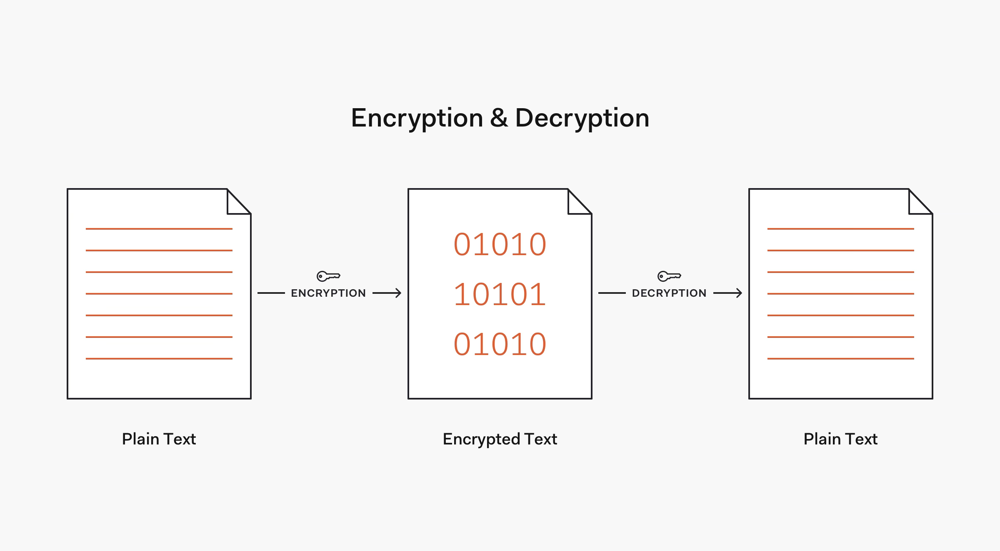
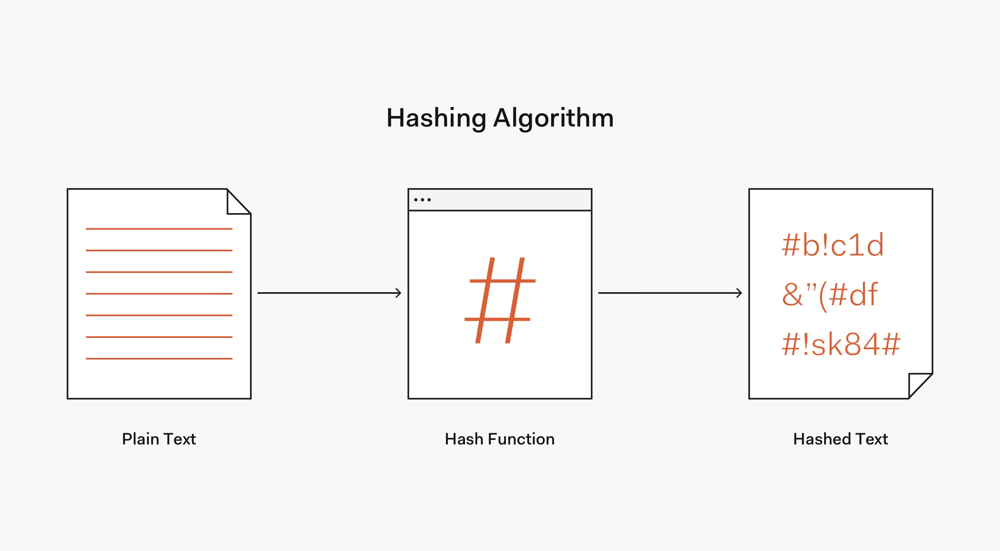
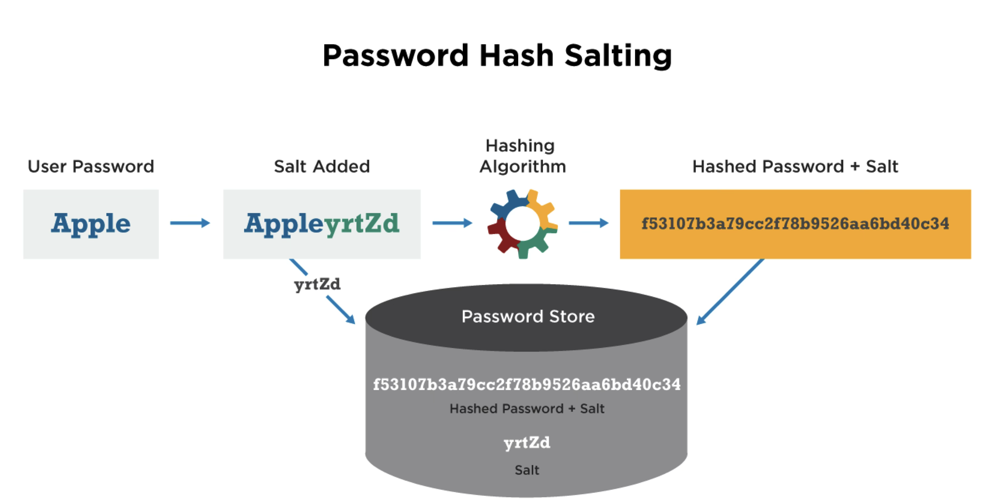

# Wachtwoorden

Wachtwoorden worden, ondanks alle beperkingen daarvan, nog steeds zeer 
veelvuldig gebruikt om gebruikers te authenticeren. Het is bovendien 
bekend dat gebruikers, ondanks aansporingen hier tegen, vaak hetzelfde 
wachtwoord hergebruiken. Het is daarom van belang om wachtwoorden veilig op 
te slaan zodat zelfs bij een datalek de wachtwoorden van gebruikers niet 
gelekt worden.

## Encryptie en hashing

Aangezien het *plaintext* opslaan van wachtwoorden op geen enkele manier als 
voldoende veilig kan worden beschouwd zal een vorm van versleuteling moeten 
worden toegepast. Hierbij zijn in beginsel twee aanpakken denkbaar. In de 
eerste plaats zou een wachtwoord versleuteld kunnen worden opgeslagen, 
bijvoorbeeld met de functie
[`openssl_encrypt`](https://www.php.net/manual/en/function.openssl-encrypt.php).
Om te controleren of het wachtwoord wat de gebruiker bij het inloggen 
opgeeft klopt, zou je dan
[`openssl_decrypt`](https://www.php.net/manual/en/function.openssl-decrypt.php)
gebruiken om het plaintext-wachtwoord te achterhalen en te controleren of de 
gebruiker het goede wachtwoord heeft opgegeven. Dit is echter geen 
acceptabele oplossing; als de broncode van de applicatie lekt, kan iedereen 
die de database verkrijgt immers alle wachtwoorden ontsleutelen. In het 
algemeen kan dan ook worden gezegd dat je een wachtwoord nooit zo mag 
opslaan, dat je de plaintextversie hiervan kan terughalen.

De betere aanpak is door gebruik te maken van
[*hashing*](https://nl.wikipedia.org/wiki/Hashfunctie).
Waar versleuteling, of encryptie, fundamenteel een omkeerbaar proces is, is 
hashing dat niet. De use case voor encryptie is immers om een bericht te 
sturen dat alleen door de beoogde ontvanger kan worden gelezen. Om dit 
mogelijk te maken moet de ontvanger het oorspronkelijke bericht kunnen 
reconstrueren aan de hand van het versleutelde bericht en een sleutel.

Bij hashing is dit niet zo. Hashing wordt historisch bijvoorbeeld gebruikt 
om te controleren of een bestand na het downloaden hetzelfde is als het 
bestand op de server. Hiertoe wordt een hashwaarde berekend voor het 
gedownloade bestand en vergeleken met een gepubliceerde hash. Als deze twee 
overeenkomen, dan is het aannemelijk, maar niet gegarandeerd, dat de bestanden 
ook overeenkomen. Voor deze toepassing is het niet nodig dat de hashfunctie 
omkeerbaar is; dit zou ook onmogelijk zijn, aangezien de hash veel kleiner 
is dan het oorspronkelijke bestand, en volgens het
[*duiventilprincipe*](https://nl.wikipedia.org/wiki/Duiventilprincipe)
er dus meerdere bestanden met dezelfde hash moeten zijn.

Hetzelfde principe kan voor wachtwoorden worden toegepast. Als we een hash 
van een wachtwoord opslaan, kan gecontroleerd worden of een later ingevuld 
wachtwoord juist is door ook van dat wachtwoord een hash te berekenen en te 
controleren of deze overeenkomt met de opgeslagen hash. Is dat zo, dan 
kunnen we aannemen dat het wachtwoord juist was. Omdat de hashfunctie niet 
omkeerbaar is, is het echter niet mogelijk om het oorspronkelijk ingevulde 
wachtwoord te achterhalen.

## Hashfuncties voor wachtwoorden

Oorspronkelijk werden voor het hashen van wachtwoorden vaak dezelfde 
functies gebruikt als voor het hashen van bestanden. Voorbeelden hiervan zijn
[MD5](https://nl.wikipedia.org/wiki/MD5) en
[SHA1](https://nl.wikipedia.org/wiki/SHA-familie). Het probleem hiermee is 
echter dat het voor het controleren van bestanden handig is als een 
hashfunctie snel te berekenen is; de te controleren bestanden kunnen immers 
zeer groot zijn en dan is het handig als je snel een hash kan berekenen. 
Voor het beschermen van wachtwoorden is dit juist niet handig; als je bij 
een datalek een hash van een wachtwoord verkregen hebt kan je, als de 
functie maar snel genoeg is, binnen redelijke tijd een
*brute-forceaanval*(https://nl.wikipedia.org/wiki/Brute_force_(methode))
uitvoeren om zo het wachtwoord te achterhalen.

Zo wordt voor het
[Bitcoin]()-protocol
SHA256 gebruikt, en hebben miners er dus belang bij om heel snel 
SHA256-hashes te kunnen berekenen. De snelste ASIC-miners hebben een hashrate
van [meer dan een biljard (10¹⁵) hashes per seconde](https://www.asicminervalue.com/efficiency/sha-256).
Dit is meer dan alle mogelijke wachtwoorden van 8 tekens die uitsluitend uit 
letters of cijfers bestaan; een dergelijke miner zou zo'n wachtwoord dus 
binnen een seconde kunnen brute-forcen.

Dit alles betekent dat aan de hashfuncties die gebruikt worden voor 
wachtwoorden meer eisen gesteld moeten worden. Met name geldt dat deze 
hashes voldoende langzaam moeten zijn en, idealiter, een zekere hoeveelheid 
geheugen moeten gebruiken. Voorbeelden hiervan zijn
[bcrypt](https://en.wikipedia.org/wiki/Bcrypt),
[scrypt](https://en.wikipedia.org/wiki/Scrypt) en
[Argon2](https://en.wikipedia.org/wiki/Argon2).

## Salt en pepper

Ook als rechtstreeks brute-forcen niet mogelijk is, zou het wel mogelijk 
kunnen zijn om een tabel te maken met wachtwoorden en hun bijbehorende 
hashes. Als dan een hash uit een datalek overeenkomt met een rij in deze 
tabel, is het wachtwoord meteen bekend. Zo'n tabel heet een
[*rainbow table*](https://nl.wikipedia.org/wiki/Rainbow_table). Om dit te 
voorkomen, kan aan elk wachtwoord een willekeurige string worden toegevoegd. 
Dit wordt de [*salt*](https://nl.wikipedia.org/wiki/Salt_(cryptografie)) 
genoemd. Merk op dat de salt bij de hash moet worden opgeslagen, aangezien 
deze per hash anders is en nodig is om later het wachtwoord te kunnen 
controleren.

Naast salt kan ook nog
[*pepper*](https://en.wikipedia.org/wiki/Pepper_(cryptography))
worden gebruikt. Dit is een string die aan elk wachtwoord wordt toegevoegd 
en voor de hele applicatie gelijk is. Deze pepper wordt niet in de database 
opgeslagen maar staat alleen in de applicatie, en bovendien niet in 
versiebeheer. Als dus alleen de database gekraakt wordt is deze waarde nog 
veilig; ook de applicatieserver waarop de waarde staat moet worden gekraakt 
om deze waarde te verkrijgen. 

## Wachtwoorden in PHP

PHP heeft een drietal functies om wachtwoorden te hashen. De functie
[`password_hash`](https://www.php.net/manual/en/function.password-hash.php) 
genereert een hash van een wachtwoord aan de hand van een specifieke 
hashfunctie. De tweede parameter geeft aan welke hashfunctie gebruikt wordt; 
als `null` of `PASSWORD_DEFAULT` mee wordt gegeven wordt een standaardkeuze 
gemaakt, die op het moment van schrijven bcrypt is. Eventueel kan in de 
derde parameter meegegeven worden wat de *cost* van de hashfunctie moet zijn;
een hogere waarde hiervoor leidt tot een langzamere hashfunctie. Normaal 
gesproken zal de standaardwaarde, 12, afdoende zijn.

Een hash die met `password_hash` gegenereerd is bevat naast de feitelijke 
hashwaarde ook informatie over de totstandkoming van de hash; zo begint een 
bcrypt-hash met `$2y$` en bevat deze ook de cost en salt. Dit betekent dat 
al deze informatie niet apart hoeft te worden opgeslagen. De functie
[`password_verify`](https://www.php.net/manual/en/function.password-verify.php)
kan gebruikt worden om te controleren of de hash overeenkomt met een bepaald 
plaintext-wachtwoord.

In principe is het mogelijk dat een hashfunctie gekraakt wordt of anderszins 
verouderd is. Aangezien de plaintext-wachtwoorden niet beschikbaar zijn, kan 
dit probleem niet meteen verholpen worden. Wat wel kan, is op het moment dat 
een gebruiker inlogt controleren of diens wachtwoordhash nog voldoet aan de 
huidige eisen. Hiervoor kan de functie
[`password_needs_rehash`](https://www.php.net/manual/en/function.password-needs-rehash.php)
worden gebruikt. Deze functie controleert of de hash gemaakt is met het 
algoritme en de opties die aan `password_needs_rehash` zijn meegegeven. Als 
dat niet zo is, kan op dat moment het wachtwoord opnieuw gehasht en 
opgeslagen worden.