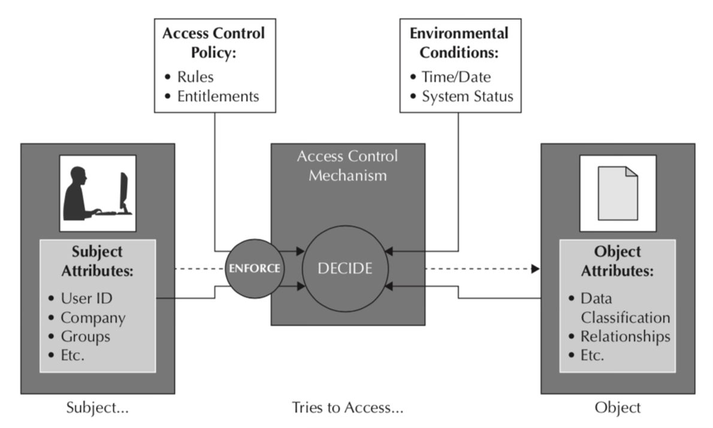

# Access control

Er zijn meerdere modellen om autorisatie te implementeren. Twee populaire 
modellen die hier besproken zullen worden zijn
*role-based access control* en *attribute-based access control*.

## Role-based access control

[Role-based access control](https://en.wikipedia.org/wiki/Role-based_access_control)
(RBAC) is een autorisatiemodel waarbij gebruikers één of meerdere rollen 
krijgen toegewezen, zoals bijvoorbeeld gebruiker, beheerder, manager of 
redacteur. Deze rollen worden dan weer gekoppeld aan concrete rechten in de 
applicatie. De check of een gebruiker een bepaalde resource kan gebruiken 
wordt dan vereenvoudigd naar de vraag of de gebruiker een specifieke rol 
heeft, die nodig is om die resource te gebruiken.

Rollen kunnen bovendien hiërarchisch zijn; een rol heeft dan alle 
rechten van zijn onderliggende rollen bevatten, met eventueel extra rechten 
toegevoegd. Zo zou de rol van beheerder alle reachten van de rollen editor 
en manager kunnen bevatten. Als dan een check gedaan wordt of de gebruiker 
de rol editor heeft, moet die check het ook accepteren als de gebruiker de 
rol beheerder heeft.

Het gebruik van rollen is een vrij intuïtieve manier om over rechten na te 
denken, dus RBAC wordt grootschalig gebruikt. Een beperking hiervan is wel 
dat de rechten vrij grofmazig zijn; het is met RBAC bijvoorbeeld niet 
mogelijk om de regel uit te drukken dat gebruikers alleen hun eigen 
blogposts, maar niet die van andere gebruikers, kunnen bewerken. De check 
kijkt immers alleen maar naar de rol die een gebruiker heeft, en niet naar 
verdere informatie over die gebruiker.

Ondanks zijn beperkingen wordt RBAC toch veel gebruikt, aangezien een groot 
aantal situaties wel passen binnen het versimpelde rechtenmodel van RBAC. 
Alleen daar waar complexere regels nodig zijn wordt vaak een alternatief 
gebruikt.

## Attribute-based access control

Wanneer RBAC te beperkend is, kunnen alternatieven worden gebruikt. Een 
voorbeeld hiervan is
[*attribute-based access control*](https://en.wikipedia.org/wiki/Attribute-based_access_control),
waarbij aan de hand van verschillende attributen bepaald kan worden of een 
gebruiker toegang heeft tot een bepaalde resource. Hierbij kan ook 
complexere logica worden gebruikt, waardoor bijvoorbeeld geregeld kan worden 
dat alle gebruikers blogs kunnen maken, maar elke gebruiker alleen diens eigen 
blog kan bewerken.

Attributen die bij ABAC gebruikt kunnen worden, kunnen eigenschappen van het 
subject zijn, zoals bijvoorbeeld de rol die een gebruiker heeft, maar ook 
eigenschappen van de uit te voeren actie of het object, zoals het id van een 
blogpost. Daarnaast kunnen er ook contextuele attributen gebruikt worden, 
zoals het tijdstip of de locatie waarop de gebruiker is. Zo kan een 
tentamensysteem zo ingericht worden dat een gebruiker een tentamen alleen 
kan bekijken en maken als de gebruiker hiervoor is ingeschreven, en 
bovendien gebruik maakt van een computer in een tentamenzaal en het tentamen 
ook op dit tijdstip afgenomen wordt.

