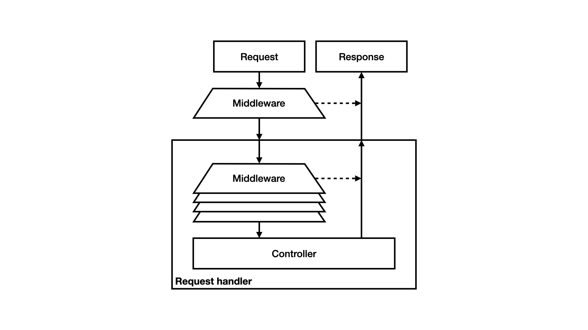

# Middleware

We gebruiken ondertussen een behoorlijk aantal services in de kernel. De 
kernel gebruikt bijvoorbeeld services voor authenticatie, autorisatie en 
routing. Het is bovendien denkbaar dat er nog meer services in de kernel 
gebruikt zouden worden. Zo zou je een service kunnen hebben die de header
`Accept-Language` leest en aan de hand hiervan een taal als attribuut 
toevoegt aan het request, zodat de pagina in de gewenste taal getoond kan 
worden. Tot nu toe voegden we services ad hoc toe aan de kernel als we ze 
nodig hadden, maar dit is geen schaalbare of generieke oplossing.

We kunnen dit generaliseren door al deze services op dezelfde manier aan te 
spreken. De gedachte is dat deze services als een soort lagen om de kernel 
liggen, en ieder mogelijk iets willen doen met het request of de response. 
Deze lagen worden meestal *middleware* genoemd.

## Chain of responsibility

Middleware kan volgens het
[*chain of responsibility pattern*](https://refactoring.guru/design-patterns/chain-of-responsibility)
geïmplementeerd worden. Dit pattern houdt in dat er een lijst met middleware 
is, die als een ketting aan elkaar gekoppeld worden. Bij het binnenkomn van 
een request wordt dit request naar de eerste middlewarelaag gestuurd. Deze 
laag mag het request zelf afhandelen. Denk hierbij bijvoorbeeld aan de al 
besproken firewall; als de gebruiker niet geautoriseerd is om een bepaalde 
route te zien kan de firewall een response met een foutpagina maken. De 
middleware hoeft het request echter niet af te handelen; in dat geval roept 
de middleware de volgende schakel in de keten aan, die op zijn beurt weer de 
gelegenheid krijgt om het request af te handelen. Uiteindelijk komt het 
request in de kernel zelf terecht, als geen van de middlewarelagen iets met 
het request kan of wil doen. Dan kan er bijvoorbeeld een foutpagina getoond 
worden met het bericht dat de pagina niet gevonden kon worden.

[PSR-15](https://www.php-fig.org/psr/psr-15) beschrijft twee interfaces die 
gebruikt kunnen worden om dit pattern te implementeren. Bij het bespreken 
van requests en responses hebben we een vereenvoudigde versie van PSR-7 
besproken, dus gebruiken we ook een iets aangepaste versie van de interfaces 
van PSR-15. De interface `MiddlewareInterface` wordt gebruikt voor de 
middlewarelagen.

```php
namespace Framework\Kernel;

interface MiddlewareInterface
{
    function process(RequestInterface $request, RequestHandlerInterface $handler): ResponseInterface;
}
```

Deze interface heeft een enkele methode `process` die de middleware de 
gelegenheid geeft iets met een request te doen. De middleware kan ervoor 
kiezen om zelf een response terug te geven, en daarmee de rest van de 
request handling buitenspel te zetten, of om de request, eventueel in 
aangepaste vorm, door te sturen naar de volgende keten in de middlewarelaag. 
Bij dit laatste kan gedacht worden aan authenticatiemiddleware, die een 
gebruiker als attribuut toevoegt aan het request maar zelf geen response 
genereert. Om de volgende middlewarelaag aan te kunnen spreken is een 
request handler beschikbaar als tweede parameter. De request handler 
implementeert de interface `RequestHandlerInterface` en heeft een enkele 
methode `handle` die een response teruggeeft bij een bepaald request.

```php
namespace Framework\Kernel;

interface RequestHandlerInterface
{
    function handle(RequestInterface $request): ResponseInterface;
}
```

De interface `RequestHandlerInterface` is heel generiek en doet denken aan 
het gedrag van een controller, maar in dit geval kan ook de rest van de 
middlewarestack, dus alle lagen die na de huidige laag nog uitgevoerd moeten 
worden, beschouwd worden als request handler. Er gaat immers een request in 
en ergens moet er een response uit komen. Dit is dan ook de request handler 
die aan de huidige middlewarelaag wordt meegegeven.



## Event handling

Een alternatieve aanpak, die hier alleen kort genoemd zal worden maar niet 
verder uitgewerkt, is het gebruik maken van het
[*observer pattern*](https://refactoring.guru/design-patterns/observer)

Dit wordt vaak door middel van een *event dispatcher* gedaan. In
[PSR-14](https://www.php-fig.org/psr/psr-14) is bijvoorbeeld een aantal 
interfaces te vinden die dit pattern beschrijft.

De event dispatcher kan arbitraire events versturen. Een voorbeeld van een 
dergelijk event is een *request event*, een event dat door de kernel verstuurd 
wordt als een request ontvangen wordt. In PSR-14 is de bijbehorende 
interface de interface `EventDispatcherInterface`, met een enkele methode 
`dispatch`.

```php
namespace Psr\EventDispatcher;

interface EventDispatcherInterface
{
    function dispatch(object $event): object;
}
```

Als een event wordt verstuurd, moet de dispatcher weten welke objecten 
geïnteresseerd zijn in dit event. In PSR-14 wordt hier een aparte interface 
`ListenerProviderInterface` voor gebruikt met een methode 
`getListenersForEvent`, die een lijst listeners moet teruggeven die 
geïnteresseerd zijn in het gegeven event. Alternatief kan dit ook in de 
event dispatcher zelf geregeld worden.

```php
namespace Psr\EventDispatcher;

interface ListenerProviderInterface
{
    function getListenersForEvent(object $event): iterable;
}
```

In PSR-14 wordt interesse normaal gesproken op klasseniveau bepaald; dat 
wil zeggen dat een object kan aangeven geïnteresseerd te zijn in alle 
events van een bepaalde klasse. In andere implementaties kan het zo zijn 
dat een event bijvoorbeeld een bepaald id heeft. 

Events worden normaal gesproken aan alle listeners gestuurd, maar soms wil 
een listener aangeven dat verdere afhandeling niet nodig is. Als 
bijvoorbeeld een listener constateert dat de gebruiker een bepaalde pagina 
niet mag zien, heeft het geen nut om nog andere listeners aan te spreken. 
Hiervoor is de interface `StoppableEventInterface` beschikbaar. Deze 
interface bevat de method `isPropagationStopped` waarmee gekeken kan 
worden of het event niet verder afgehandeld moet worden; het 
daadwerkelijk stoppen van de verdere afhandeling is 
implementatiespecifiek. Dit concept is vergelijkbaar met de JavaScript-methode
[`stopPropagation`](https://developer.mozilla.org/en-US/docs/Web/API/Event/stopPropagation).

```php
namespace Psr\EventDispatcher;

interface StoppableEventInterface
{
    function isPropagationStopped(): bool;
}
```

In de context van een kernel kan dit systeem gebruikt worden als alternatief 
voor een *chain of responsibility*. Er zal dan een eventklasse moeten 
bestaan waarin een request wordt opgeslagen en een response kan worden 
opgeslagen. Geïnteresseerde middlewarelagen melden zich aan bij de event 
dispatcher en de kernel verstuurt bij elk request een dergelijk event. Een 
middlewarelaag, of in de termen van de event dispatcher een *listener*, kan 
dan het request aanpassen en eventueel een response in het event zetten. Na 
afloop van de event handling kan de response die uiteindelijk in het event 
staat naar de client worden gestuurd.